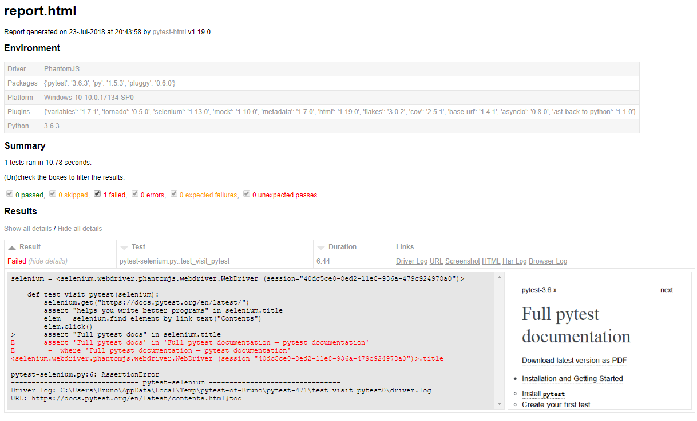

Lab 5. Plugins
---------------------------


In the previous lab, we explored one of the most important features
of pytest: fixtures. We learned how we can use fixtures to manage
resources and make our lives easier when writing tests.

pytest is constructed with customization and flexibility in mind, and
allows developers to write powerful extensions
called [**plugins**]. Plugins in pytest can do all sorts of
things, from simply providing a new fixture, all the way to adding
command line options, changing how tests are executed, and even running
tests written in other languages.

In this lab, we will do the following:


-   Learn how to find and install plugins
-   Have a taste of what plugins the ecosystem has to offer


#### Pre-reqs:
- Google Chrome (Recommended)

#### Lab Environment
Al labs are ready to run. All packages have been installed. There is no requirement for any setup.

All exercises are present in `/pytest-labs/pytest-quickstart/code` folder.


Finding and installing plugins 
-------------------------------

As mentioned at the beginning of the lab,
pytest is written from the ground up with
customization and flexibility in mind. The plugin mechanism is at the
core of the pytest architecture, so much so that many of pytest\'s
built-in features are implemented in terms of internal plugins, such as
marks, parametrization, fixtures---nearly everything, even command-line
options.

This flexibility has led to an enormous and rich plugin ecosystem. At
the time of writing, the number of plugins available is over 500, and
that number keeps increasing at an astonishing rate. 


### Finding plugins

Given the large number of plugins, it would be nice if there was a site
that showed all pytest plugins along with their descriptions. It would
also be nice if this place also showed
information about compatibility with different Python and pytest
versions.

Well, the good news is that such a site exists, and it is maintained by
the core development team: pytest plugin compatibility
(<http://plugincompat.herokuapp.com/>). On it, you will find a list of
all the pytest plugins available in PyPI, along with Python- and
pytest-version compatibility information. The site is fed daily with new
plugins and updates directly from PyPI, making it a great place to
browse for new plugins.

### Installing plugins

Plugins are usually installed with `pip`:


``` {.programlisting .language-markup}
pip install <PLUGIN_NAME>
```

For example, to install `pytest-mock`, we
execute the following:


``` {.programlisting .language-markup}
pip install pytest-mock
```


No registration of any kind is necessary; pytest automatically detects
the installed plugins in your virtual environment or Python
installation. 

This simplicity makes it dead easy to try out new plugins. 


An overview of assorted plugins 
-------------------------------------------------


Now, we will take a look at some useful
and/or interesting plugins. Of course, it is not possible to cover all
plugins here, so we will try to cover the ones that cover popular
frameworks and general capabilities, with a few obscure plugins thrown
in. Of course, this barely scratches the surface, but let\'s get to it.


### pytest-xdist


This is a very popular plugin and is
maintained by the core developers; it allows
you to run tests under multiple CPUs, to speed up the test run.

After installing it, simply use the `-n` command-line flag to
use the given number of CPUs to run the tests:


``` {.programlisting .language-markup}
pytest -n 4
```


And that\'s it! Now, your tests will run across four cores and hopefully
speed up the test suite quite a bit, if it is CPU intensive, thought
I/O-bound tests won\'t see much improvement, though. You can also use
`-n auto` to let `pytest-xdist` automatically figure
out the number of CPUs you have available.


### Note

Keep in mind that when your tests are running concurrently, and in
random order, they must be careful to avoid stepping on each other\'s
toes, for example, reading/writing to the same directory. While they
should be idempotent anyway, running the tests in a random order often
brings attention to problems that were lying dormant until then. 


### pytest-cov


The `pytest-cov` plugin provides
integration with the popular coverage module, which
provides detailed coverage reports for your
code when running tests. This lets you detect sections of code that are
not covered by any test code, which is an opportunity to write more
tests to cover those cases.

After installation, you can use the `--cov` option to provide
a coverage report at the end of the test run:


``` {.programlisting .language-markup}
pytest --cov=src
...
----------- coverage: platform win32, python 3.6.3-final-0 -----------
Name                  Stmts   Miss  Cover
----------------------------------------
src/series.py           108      5   96%
src/tests/test_series    22      0  100%
----------------------------------------
TOTAL                   130      5   97%
```


The `--cov` option accepts a path to source files that should
have reports generated, so you should pass your `src` or
package directory depending on your project\'s layout. 

You can also use the `--cov-report` option to generate reports
in various formats: XML, annotate, and HTML. The latter is especially
useful to use locally because it generates HTML files showing your code,
with missed lines highlighted in red, making it very easy to find those
uncovered spots.

This plugin also works with `pytest-xdist` out of the box.

Finally, the `.coverage` file generated by this plugin is
compatible with many online services that provide coverage tracking and
reporting, such as `coveralls.io` (<https://coveralls.io/>[)
and
`codecov.io` (](https://coveralls.io/)<https://codecov.io/>[).](https://coveralls.io/)

### pytest-faulthandler


This plugin automatically enables
the built-in
`faulthandler` (<https://docs.python.org/3/library/faulthandler.html>)
module when running your tests, which outputs Python tracebacks in
catastrophic cases such as a segmentation fault. After installed, no
other setup or flag is required; the `faulthandler` module
will be enabled automatically.

This plugin is strongly recommended if you regularly use extension
modules written in C/C++, as those are more susceptible to crashes.

### pytest-mock


The `pytest-mock` plugin provides a
fixture that allows a smoother integration
between pytest and the
`unittest.mock` (<https://docs.python.org/3/library/unittest.mock.html>)
module of the standard library. It provides
functionality similar to the built-in `monkeypatch` fixture,
but the mock objects produced by `unittest.mock` also record
information on how they are accessed. This makes many common testing
tasks easier, such as verifying that a mocked function has been called,
and with which arguments.

The plugin provides a `mocker` fixture that can be used for
patching classes and methods. Using the `getpass` example from
the last lab, here is how you could write it using this plugin:


``` {.programlisting .language-markup}
import getpass

def test_login_success(mocker):
    mocked = mocker.patch.object(getpass, "getpass", 
                                 return_value="valid-pass")
    assert user_login("test-user")
mocked.assert_called_with("enter password: ")
```


Note that besides replacing `getpass.getpass()` and always
returning the same value, we can also ensure that the
`getpass` function has been called with the correct arguments.

The same advice on how and where to patch the `monkeypatch`
fixture from the previous lab also applies when using this plugin.

### pytest-django


As the name suggests, this plugin allows you
to test your `Django`
(<https://www.djangoproject.com/>) applications using pytest.
`Django` is one of the most famous
web frameworks in use today.

The plugin provides a ton of features:


-   A very nice Quick Start tutorial
-   Command-line and `pytest.ini` options to configure Django
-   Compatibility with `pytest-xdist`
-   Database access using the `django_db` mark, with automatic
    transaction rollback between tests, as well as a bunch of fixtures
    that let you control how the database is managed
-   Fixtures to make requests to your application: `client`,
    `admin_client`, and `admin_user`
-   A `live_server` fixture that runs a `Django`
    server in a background thread


All in all, this is one of the most complete plugins available in the
ecosystem, with too many features to cover here. It is a must-have for
`Django` applications, so make sure to check out its extensive
documentation.

### pytest-flakes


This plugin allows you to check
your code
using `pyflakes` (<https://pypi.org/project/pyflakes/>), which
is a static checker of source files for common errors, such as missing
imports and unknown variables.

After installed, use the `--flakes` option to activate it:


``` {.programlisting .language-markup}
pytest pytest-flakes.py --flake
...
============================= FAILURES ==============================
__________________________ pyflakes-check ___________________________
CH5\pytest-flakes.py:1: UnusedImport
'os' imported but unused
CH5\pytest-flakes.py:6: UndefinedName
undefined name 'unknown'
```


This will run the flake checks alongside your normal tests, making it an
easy and cheap way to keep your code tidy and prevent some errors. The
plugin also keeps a local cache of files that have not changed since the
last check, so it is fast and convenient to use locally.

### pytest-asyncio


The `asyncio`
(<https://docs.python.org/3/library/asyncio.html>) module is
one of the hot new additions to Python 3,
providing a new framework for asynchronous
applications. The `pytest-asyncio` plugin lets[]{#id325092131
.indexterm} you write asynchronous test functions, making it a snap to
test your asynchronous code.

All you need to do is make your test function `async def` and
mark it with the `asyncio` mark:


``` {.programlisting .language-markup}
@pytest.mark.asyncio
async def test_fetch_requests():
    requests = await fetch_requests("example.com/api")
    assert len(requests) == 2
```


The plugin also manages the event loop behind the scenes, providing a
few options on how to change it if you need to use a custom event loop.


### Note

You are, of course, free to have normal synchronous test functions along
with the asynchronous ones.


### pytest-trio


Trio\'s motto is Pythonic async I/O
for humans
(<https://trio.readthedocs.io/en/latest/>). It uses the same
`async def`/`await` keywords of the
`asyncio` standard module, but it is considered simpler and
more friendly to use, containing some novel ideas about how to deal with
timeouts and groups of parallel tasks in a way to avoid common errors in
parallel programming. It is definitely worth checking out if you are
into asynchronous development.

 

`pytest-trio` works similarly to `pytest-asyncio`:
you write asynchronous test functions and mark them using the
`trio` mark. It also provides other functionality that makes
testing easier and more reliable, such as controllable clocks for
testing timeouts, special functions to deal with tasks, mocking network
sockets and streams, and a lot more.

### pytest-tornado


Tornado (<http://www.tornadoweb.org/en/stable/>) is a web[]{#id325536844
.indexterm} framework and asynchronous
network library. It is very mature, works in Python 2 and 3, and the
standard `asyncio` module borrowed many ideas and concepts
from it.

`pytest-asyncio` was heavily
inspired by `pytest-tornado`, so it works with the same idea
of using a `gen_test` to mark your test as a coroutine. It
uses the `yield` keyword instead of `await`, as it
supports Python 2, but otherwise it looks very similar:


``` {.programlisting .language-markup}
@pytest.mark.gen_test
def test_tornado(http_client):
    url = "https://docs.pytest.org/en/latest"
    response = yield http_client.fetch(url)
    assert response.code == 200
```


### pytest-postgresql


This plugin allows you to test code that
needs a running PostgreSQL database.

Here\'s a quick example of it in action:


``` {.programlisting .language-markup}
def test_fetch_series(postgresql):
    cur = postgresql.cursor()
    cur.execute('SELECT * FROM comedy_series;')
    assert len(cur.fetchall()) == 5
    cur.close()
```


It provides two fixtures:


-   `postgresql`: a client fixture that starts and closes
    connections to the running test database. At the end of the test, it
    drops the test database to ensure tests don\'t interfere with one
    another.
-   `postgresql_proc`: a session-scoped fixture that starts
    the PostgreSQL process once per session and ensures that it stops at
    the end.


 

It also provides several configuration options on how to connect and
configure the testing database.

### docker-services


This plugin starts and manages Docker
services you need in order to test your code.
This makes it simple to run the tests because you don\'t need to
manually start the services yourself; the plugin will start and stop
them during the test session, as needed.

You configure the services using a `.services.yaml` file; here
is a simple example:


``` {.programlisting .language-markup}
database:
    image: postgresenvironment:
        POSTGRES_USERNAME: pytest-userPOSTGRES_PASSWORD: pytest-passPOSTGRES_DB: test
    image: regis:10
```


This will start two services: `postgres` and
`redis`.

With that, all that\'s left to do is to run your suite with the
following:


``` {.programlisting .language-markup}
pytest --docker-services
```


The plugin takes care of the rest.

### pytest-selenium


Selenium is a framework targeted to
automating browsers, to test web applications
(<https://www.seleniumhq.org/>). It lets you do things such as opening a
web page, clicking on a button, and then
ensuring that a certain page loads, all programmatically. It supports
all the major browsers out there and has a thriving community.

`pytest-selenium` provides you with a fixture that lets you
write tests that do all of those things, taking care of setting up
`Selenium` for you.

Here\'s a basic example of how to visit a page, click on a link, and
check the title of the loaded page:


``` {.programlisting .language-markup}
def test_visit_pytest(selenium):
    selenium.get("https://docs.pytest.org/en/latest/")
    assert "helps you write better programs" in selenium.title
    elem = selenium.find_element_by_link_text("Contents")
    elem.click()
    assert "Full pytest documentation" in selenium.title
```


`Selenium` and `pytest-selenium` are sophisticated
enough to test a wide range of applications, from static pages to full
single-page frontend applications.

### pytest-html


`pytest-html` generates beautiful
HTML reports of your test results. After
installing the plugin, simply run this:


``` {.programlisting .language-markup}
pytest --html=report.html
```


This will generate a `report.html` file at the end of the test
session.
Because pictures speak louder than words, here is an example:





 
The reports can be served in a web server for easier viewing, plus they
contain nice functionality such as checkboxes to show/hide different
types of test results, and other
plugins such as `pytest-selenium`
are even able to attach screenshots to failed tests, as in the previous
image.

It's definitely worth checking out.

### pytest-cpp


To prove the point that pytest\'s
framework is very flexible, the
`pytest-cpp` plugin allows you to run tests written in Google
Test (<https://github.com/google/googletest>) or Boost.Test
([https://www.boost.org](https://www.boost.org/)[)](https://www.boost.org/),
which are frameworks for writing and running
tests in the C++ language. 

After they are installed, you just need to run pytest as normal:


``` {.programlisting .language-markup}
pytest bin/tests
```


Pytest will find executable files containing test cases,
detecting  automatically whether they are written in
`Google Test` or `Boost.Python`. It will run the
tests and report results normally, with neat formatting that is familiar
to pytest users.

Running those tests with pytest means that they now can make use of
several features, such as parallel running with
`pytest-xdist`, test selection with `-k`, JUnitXML
reports, and so on. This plugin is particularly useful for code bases
that use Python and C++ because it allows you to run all tests with a
single command, and you can obtain a unique report.

### pytest-timeout


The `pytest-timeout` plugin terminates[]{#id325537238
.indexterm} tests automatically after they
reach a certain timeout. 

You use it by setting a global timeout in the command-line:


``` {.programlisting .language-markup}
pytest --timeout=60
```


Or you can mark individual tests with the
`@pytest.mark.timeout` mark:


``` {.programlisting .language-markup}
@pytest.mark.timeout(600)
def test_long_simulation():
   ...
```


It works by using one of the two following methods to implement its
timeout mechanism:


-   `thread`: during test setup, the plugin starts a thread
    that sleeps for the desired timeout period. If the thread wakes up,
    it will dump the tracebacks of all the threads to `stderr`
    and kill the current process. If the test finishes before the thread
    wakes up, then the thread is cancelled and the test run continues.
    This is the method that works on all platforms.
-   `signal`: a `SIGALRM` is scheduled during test
    setup and canceled when the test finishes. If the alarm is
    triggered, it will dump the tracebacks of all threads to
    `stderr` and fail the test, but it will allow the test run
    to continue. The advantage over the thread method is that it won\'t
    cancel the entire run when a timeout occurs, but it is not supported
    on all platforms.


The method is chosen automatically based on platform, but it can be
changed in the command line or per-test by passing the
`method=` parameter to `@pytest.mark.timeout`.

This plugin is indispensable in large test suites to avoid having tests
hanging the CI.

### pytest-annotate


Pyannotate (<https://github.com/dropbox/pyannotate>) is a
project that observes runtime
type information and can use that
information to insert type annotations into
the source code, and `pytest-annotate` makes it easy to use
with pytest.

Let\'s get back to this simple test case:


``` {.programlisting .language-markup}
def highest_rated(series):
    return sorted(series, key=itemgetter(2))[-1][0]

def test_highest_rated():
    series = [
        ("The Office", 2005, 8.8),
        ("Scrubs", 2001, 8.4),
        ("IT Crowd", 2006, 8.5),
        ("Parks and Recreation", 2009, 8.6),
        ("Seinfeld", 1989, 8.9),
    ]
    assert highest_rated(series) == "Seinfeld"
```


After installing `pytest-annotate`, we can generate an
annotations file passing the `--annotations-output` flag:


``` {.programlisting .language-markup}
pytest --annotate-output=annotations.json
```


This will run the test suite as usual, but it will collect type
information for later use.

Afterward, you can call `PyAnnotate` to apply the type
information directly to the source code:


``` {.programlisting .language-markup}
pyannotate --type-info annotations.json -w
Refactored test_series.py
--- test_series.py (original)
+++ test_series.py (refactored)
@@ -1,11 +1,15 @@
 from operator import itemgetter
+from typing import List
+from typing import Tuple


 def highest_rated(series):
+    # type: (List[Tuple[str, int, float]]) -> str
     return sorted(series, key=itemgetter(2))[-1][0]


 def test_highest_rated():
+    # type: () -> None
     series = [
         ("The Office", 2005, 8.8),
         ("Scrubs", 2001, 8.4),
Files that were modified:
pytest-annotate.py
```


It is very neat to quickly and efficiently annotate a large code base,
especially if that code base is well covered by tests.

### pytest -qt


The `pytest -qt` plugin allows you
to write tests for GUI applications written
in the `Qt` framework (<https://www.qt.io/>), supporting the
more popular sets of Python bindings for
`Qt`: `PyQt4`/`PyQt5`,
and `PySide`/`PySide2`. 

It provides a `qtbot` fixture that has methods to interact
with a GUI application, such as clicking on buttons, entering text in
fields, waiting for windows to pop up, and others. Here\'s a quick
example showing it in action:


``` {.programlisting .language-markup}
def test_main_window(qtbot):
    widget = MainWindow()
    qtbot.addWidget(widget)

    qtbot.mouseClick(widget.about_button, QtCore.Qt.LeftButton)
    qtbot.waitUntil(widget.about_box.isVisible)
    assert widget.about_box.text() == 'This is a GUI App'
```


Here, we create a window, click on the **`about`** button, wait for the
**`about`** box to show up, and then ensure it shows the text we
expect. 

It also contains other goodies:


-   Utilities to wait for specific `Qt` signals
-   Automatic capturing of errors in virtual methods
-   Automatic capturing of `Qt` logging messages


### pytest-randomly


Tests ideally should be independent from each
other, making sure to clean up after
themselves so they can be run in any order and don\'t affect one another
in any way. 

`pytest-randomly` helps you keep your test suite true to that
point, by randomly ordering tests, changing their order every time you
run your test suite. This helps detect whether the tests have hidden
inter-dependencies that you would not find otherwise.

It shuffles the order of the test items at module level, then at class
level, and finally at the order of functions. It also resets
`random.seed()` before each test to a fixed number, which is
shown at the beginning of the test section. The random seed can be used
at a later time to reproduce the same order with the
`--randomly-seed` command line to reproduce a failure.

As an extra bonus, it also has special support
for `factory boy`
(<https://factoryboy.readthedocs.io/en/latest/reference.html>),
`faker` (<https://pypi.python.org/pypi/faker>), and
`numpy` (<http://www.numpy.org/>) libraries, resetting their
random state before each test.

### pytest-datadir


Often, tests need a supporting file, for
example a CSV file containing data about
comedy series, as we saw in the last lab. `pytest-datadir`
allows you to save files alongside your tests and easily access them
from the tests in a safe manner.

Suppose you have a file structure such as this:


``` {.programlisting .language-markup}
tests/
    test_series.py
```


In addition to this, you have a `series.csv` file that you
need to access from tests defined in `test_series.py`.

With `pytest-datadir` installed, all you need to do is to
create a directory with the name of the test file in the same directory
and put the file there:


``` {.programlisting .language-markup}
tests/
    test_series/
        series.csv
    test_series.py
```


The `test_series` directory and `series.csv` should
be saved to your version-control system.

Now, tests in `test_series.py` can use the `datadir`
fixture to access the file:


``` {.programlisting .language-markup}
def test_ratings(datadir):
    with open(datadir / "series.csv", "r", newline="") as f:
        data = list(csv.reader(f))
    ...
```


`datadir` is a Path instance pointing to the[]{#id325540528
.indexterm} data directory
(<https://docs.python.org/3/library/pathlib.html>).

One important thing to note is that when we use the `datadir`
fixture in a test, we are not accessing the path to the original file,
but a temporary copy. This ensures that
tests can modify the files inside the data
directory without affecting other tests because each test has its own
copy.

### pytest-regressions


It is normally the case that your application
or library contains functionality that
produces a data set as the result.

Testing these results is often tedious and error-prone, producing tests
such as this:


``` {.programlisting .language-markup}
def test_obtain_series_asserts():
    data = obtain_series()
    assert data[0]["name"] == "The Office"
    assert data[0]["year"] == 2005
    assert data[0]["rating"] == 8.8
    assert data[1]["name"] == "Scrubs"
    assert data[1]["year"] == 2001
    ...
```


This gets old very quickly. Also, if any of the assertion fails, then
the test stops at that point, and you won\'t know whether any other
asserts after that point would also have failed. In other words, you
don\'t get a clear picture of the overall failures. Most of all, this is
also heavily unmaintainable because if the data returned by
`obtain_series()` ever changes, you are in for a tedious and
error-prone task of updating all the code.

`pytest-regressions` provides fixtures to solve this kind of
problem. General data such as the previous example is a job for the
`data_regression` fixture:


``` {.programlisting .language-markup}
def test_obtain_series(data_regression):
    data = obtain_series()
data_regression.check(data)
```


The first time you execute this test, it will fail with a message such
as this:


``` {.programlisting .language-markup}
...
E Failed: File not found in data directory, created:
E - CH5\test_series\test_obtain_series.yml
```


It will dump the data passed to `data_regression.check()` in a
nicely formatted YAML file into the data directory of the
`test_series.py` file (courtesy of the
`pytest-datadir` fixture we saw earlier):


``` {.programlisting .language-markup}
- name: The Office
  rating: 8.8
  year: 2005
- name: Scrubs
  rating: 8.4
  year: 2001
- name: IT Crowd
  rating: 8.5
  year: 2006
- name: Parks and Recreation
  rating: 8.6
  year: 2009
- name: Seinfeld
  rating: 8.9
  year: 1989
```


The next time you run this test, `data_regression` now
compares the data passed to `data_regressions.check()` with
the data found in `test_obtain_series.yml` inside the data
directory. If they match, the test passes.

If the data is changed, however, the test fails with a nicely
formatted text differential  between the new data and the recorded one:


``` {.programlisting .language-markup}
E AssertionError: FILES DIFFER:
E ---
E
E +++
E
E @@ -13,3 +13,6 @@
E
E  - name: Seinfeld
E    rating: 8.9
E    year: 1989
E +- name: Rock and Morty
E +  rating: 9.3
E +  year: 2013
```


In some cases, this might be a regression, in which case you can hunt
down the bug in the code.

But in this case, the new data is [*correct;*] you just need
to run pytest with the `--force-regen` flag and
`pytest-regressions` will update the data file with the new
content for you:


``` {.programlisting .language-markup}
E Failed: Files differ and --force-regen set, regenerating file at:
E - CH5\test_series\test_obtain_series.yml
```


Now, the test passes if we run it again, as the file contains the new
data.

This is an immense time saver when you have
dozens of tests that suddenly produce
different but correct results. You can bring them all up to date with a
single pytest execution.

I use this plugin myself, and I can\'t count the hours it has saved me.


Honorable mentions 
------------------------------------


There are just too many good plugins to fit into this lab. The
previous sample is really just a small taste, where I tried to strike a
balance between useful, interesting, and showing the flexibility of the
plugin architecture.

Here are a few other plugins that are worth mentioning:


-   `pytest-bdd`: a behavior-driven development for pytest
-   `pytest-benchmark`: a fixture to benchmark code. It
    outputs benchmark results with color output
-   `pytest-csv`: outputs test status as CSV files
-   `pytest-docker-compose`: this manages Docker containers,
    using Docker compose during test runs
-   `pytest-excel`: outputs test status reports in Excel
-   `pytest-git`: provides a git fixture for tests that need
    to deal with git repositories
-   `pytest-json`: outputs test statuses as json files
-   `pytest-leaks`: detects memory leaks, by running tests
    repeatedly and comparing reference counts
-   `pytest-menu`: lets the user select tests to run from a
    menu in the console
-   `pytest-mongo`: process and client fixtures for MongoDB
-   `pytest-mpl`: plugin that tests figures output from
    Matplotlib
-   `pytest-mysql`: process and client fixtures for MySQL
-   `pytest-poo`: replaces the `F` character for
    failing tests with the \"pile of poo\" emoji
-   `pytest-rabbitmq`: process and client fixtures for
    RabbitMQ
-   `pytest-redis`: process and client fixtures for Redis
-   `pytest-repeat`: repeats all tests or specific tests a
    number of times to find intermittent failures
-   `pytest-replay`: saves test runs and allows the user to
    execute them later, so as to reproduce crashes and flaky tests
-   `pytest-rerunfailures`: this marks tests that can be run
    more than once to eliminate flaky tests
-   `pytest-sugar`: changes the look and feel of the pytest
    console, by adding progress bars, emojis, instant failures, and so
    on
-   `pytest-tap`: toutputs test reports in TAP format
-   `pytest-travis-fold`: folds captured output and coverage
    reports in the Travis CI build log
-   `pytest-vagrant`: pytest fixture that works with vagrant
    boxes
-   `pytest-vcr`: automatically
    manages `VCR.py` cassettes
    (<https://vcrpy.readthedocs.io/en/latest/>), using a simple mark
-   `pytest-virtualenv`: this provides a virtualenv fixture to
    manage virtual environments in tests


-   `pytest-watch`: this continuously watches for changes in
    the source code and reruns pytest
-   `pytest-xvfb`: this runs `Xvfb` (a virtual frame
    buffer) for your UI tests
-   `tavern`: is tan automated test for APIs using a
    YAML-based syntax
-   `xdoctest`: rewrite of the built-in doctests module, to
    make doctests easier to write and simpler to configure


Remember, at the time of writing, the number of pytest plugins available
is over 500, so make sure to browse the list of plugins so that you can
find something to your liking.


Summary 
-------------------------


In this lab, we looked at how easy it is to find and install
plugins. We also have been shown some plugins that I use daily and find
interesting. I hope this has given you a taste of what\'s possible in
pytest, but please explore the vast number of plugins to see whether you
can find any that are useful.

Creating your own plugins is not a topic that is covered in this course,
but if you are interested, here are some resources to get you started:


-   The pytest documentation: writing plugins
    (<https://docs.pytest.org/en/latest/writing_plugins.html>).


In the next lab, we will learn how to use pytest with existing
`unittest`-based test suites, including tips and suggestions
on how to migrate them and incrementally use more of pytest\'s features.
