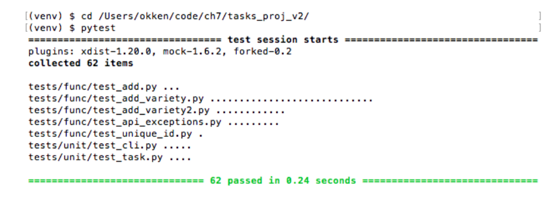
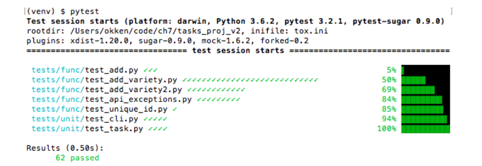
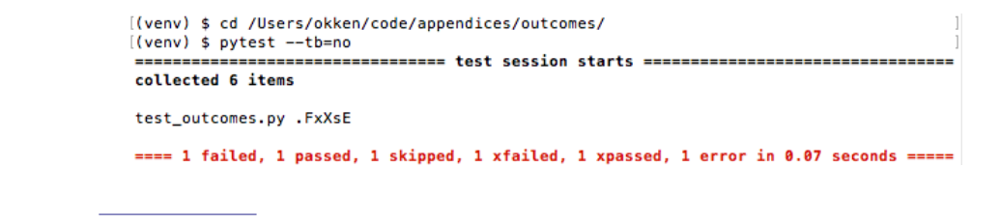
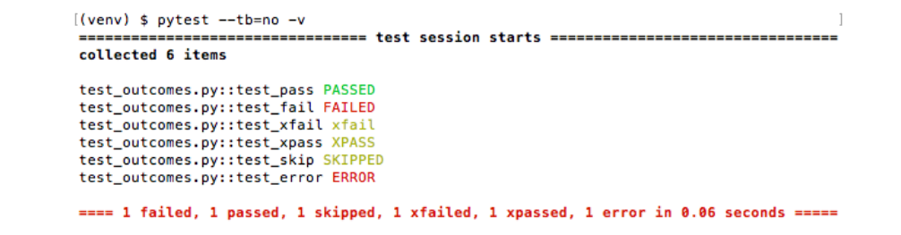
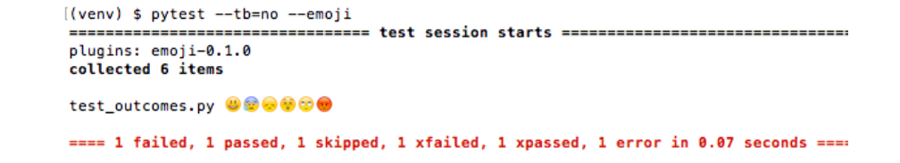
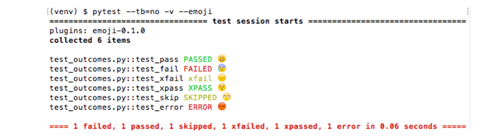
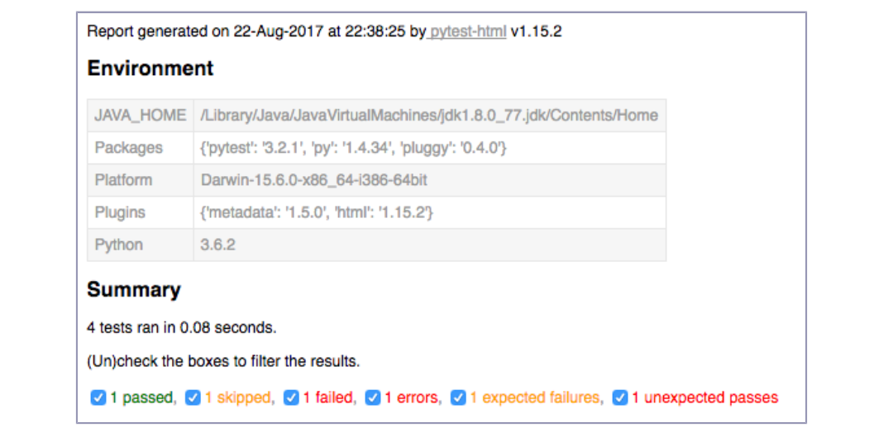
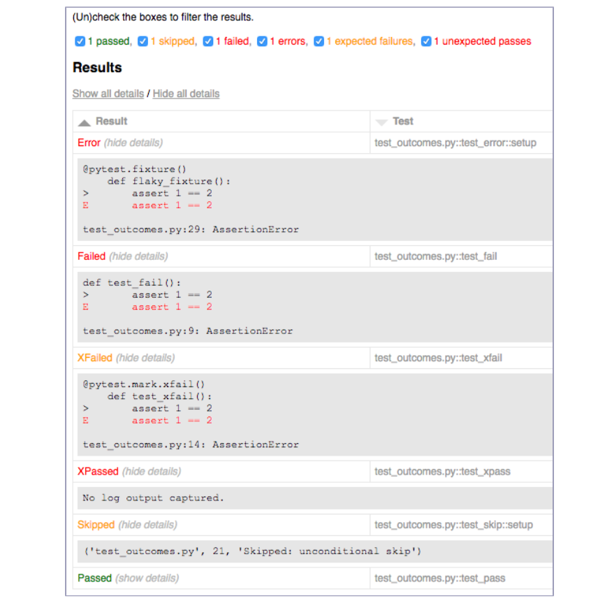

**APPENDIX 3**

### Plugin Sampler Pack

Plugins are the booster rockets that enable you to get even more power out
of pytest. So many useful plugins are available, it’s difficult to pick just a
handful to showcase. You’ve already seen the pytest-cov plugin in Coverage.py:
Determining How Much Code Is Tested, and the pytest-mock plugin
in mock: Swapping Out Part of the System The following plugins
give you just a taste of what else is out there.

All of the plugins featured here are available on PyPI and are installed with
pip install <plugin-name>.

### Plugins That Change the Normal Test Run Flow

The following plugins in some way change how pytest runs your tests.

**pytest-repeat: Run Tests More Than Once**

To run tests more than once per session, use the pytest-repeat plugin. This
plugin is useful if you have an intermittent failure in a test.

Following is a normal test run of tests that start with test_list from ch7/tasks
_proj_v2:


##### Step 1


##### $ cd /pytest-labs/testing-with-pytest/code/ch7/tasks_proj_v2

##### $ pip install .

##### $ pip install pytest-repeat

##### $ cd tests

##### $ pytest -v -k test_list

##### $ pytest -v -k test_list

```
===================== test session starts =====================
plugins: repeat-0.7.0, mock-1.10.0
collected 62 items / 56 deselected
```

1. https://pypi.python.org/pypi/pytest-repeat

```
func/test_api_exceptions.py::test_list_raises PASSED            [ 16%]
unit/test_cli.py::test_list_no_args PASSED            [ 33%]
unit/test_cli.py::test_list_print_empty PASSED            [ 50%]
unit/test_cli.py::test_list_print_many_items PASSED            [ 66%]
unit/test_cli.py::test_list_dash_o PASSED            [ 83%]
unit/test_cli.py::test_list_dash_dash_owner PASSED            [100%]
=========== 6 passed, 56 deselected in 0.13 seconds ===========
```

With the pytest-repeat plugin, you can use --count to run everything twice:


##### Step 2


##### $ pytest --count=2 -v -k test_list

```
===================== test session starts =====================
plugins: repeat-0.7.0, mock-1.10.0
collected 124 items / 112 deselected
func/test_api_exceptions.py::test_list_raises[1/2] PASSED            [ 8%]
func/test_api_exceptions.py::test_list_raises[2/2] PASSED            [ 16%]
unit/test_cli.py::test_list_no_args[1/2] PASSED            [ 25%]
unit/test_cli.py::test_list_no_args[2/2] PASSED            [ 33%]
unit/test_cli.py::test_list_print_empty[1/2] PASSED            [ 41%]
unit/test_cli.py::test_list_print_empty[2/2] PASSED            [ 50%]
unit/test_cli.py::test_list_print_many_items[1/2] PASSED            [ 58%]
unit/test_cli.py::test_list_print_many_items[2/2] PASSED            [ 66%]
unit/test_cli.py::test_list_dash_o[1/2] PASSED            [ 75%]
unit/test_cli.py::test_list_dash_o[2/2] PASSED            [ 83%]
unit/test_cli.py::test_list_dash_dash_owner[1/2] PASSED            [ 91%]
unit/test_cli.py::test_list_dash_dash_owner[2/2] PASSED            [100%]
========== 12 passed, 112 deselected in 0.16 seconds ==========
```

You can repeat a subset of the tests or just one, and even choose to run it
1,000 times overnight if you want to see if you can catch the failure. You can
also set it to stop on the first failure.

**pytest-xdist: Run Tests in Parallel**

Usually all tests run sequentially. And that’s just what you want if your tests
hit a resource that can only be accessed by one client at a time. However, if
your tests do not need access to a shared resource, you could speed up test
sessions by running multiple tests in parallel. The pytest-xdist plugin allows
you to do that. You can specify multiple processors and run many tests in
parallel. You can even push off tests onto other machines and use more than
one computer.

Here’s a test that takes at least a second to run, with parametrization such
that it runs ten times:

```
appendices/xdist/test_parallel.py
import pytest
import time
```

```
@pytest.mark.parametrize( 'x' , list(range(10)))
def test_something(x):
time.sleep(1)
```

Notice that it takes over ten seconds to run normally:


##### Step 3


##### $ pip install pytest-xdist

##### $ cd /pytest-labs/testing-with-pytest/code/appendices/xdist

##### $ pytest test_parallel.py

```
=================== test session starts ===================
plugins: xdist-1.23.0, forked-0.2
collected 10 items
test_parallel.py .......... [100%]
=============== 10 passed in 10.06 seconds ================
```

With the pytest-xdist plugin, you can use -n numprocesses to run each test in a
subprocess, and use -n auto to automatically detect the number of CPUs on
the system. Here’s the same test run on multiple processors:


##### Step 4


##### $ pytest -n auto test_parallel.py

```
=================== test session starts ===================
plugins: xdist-1.23.0, forked-0.2
gw0 [10] / gw1 [10] / gw2 [10] / gw3 [10]
scheduling tests via LoadScheduling
.......... [100%]
================ 10 passed in 4.00 seconds ================
```

It’s not a silver bullet to speed up your test times by a factor of the number
of processors you have—there is overhead time. However, many testing sce-
narios enable you to run tests in parallel. And when the tests are long, you
may as well let them run in parallel to speed up your test time.

The pytest-xdist plugin does a lot more than we’ve covered here, including the
ability to offload tests to different computers altogether, so be sure to read
more about the pytest-xdist plugin on PyPI.

**pytest-timeout: Put Time Limits on Your Tests**

There are no normal timeout periods for tests in pytest. However, if you’re
working with resources that may occasionally disappear, such as web services,
it’s a good idea to put some time restrictions on your tests.

The pytest-timeout plugin does just that. It allows you pass a timeout period
on the command line or mark individual tests with timeout periods in seconds.

2. https://pypi.python.org/pypi/pytest-xdist
3. https://pypi.python.org/pypi/pytest-timeout


The mark overrides the command-line timeout so that the test can be either
longer or shorter than the timeout limit.

Let’s run the tests from the previous example (with one-second sleeps) with
a half-second timeout:


##### Step 5


##### $ cd /pytest-labs/testing-with-pytest/code/appendices/xdist

##### $ pip install pytest-timeout

##### $ pytest --timeout=0.5 -x test_parallel.py

```
=================== test session starts ===================
plugins: xdist-1.23.0, timeout-1.3.2, forked-0.2
timeout: 0.5s
timeout method: signal
timeout func_only: False
collected 10 items
test_parallel.py F
======================== FAILURES =========================
____________________ test_something[0] ____________________
x = 0
@pytest.mark.parametrize('x', list(range(10)))
def test_something(x):
> time.sleep(1)
E Failed: Timeout >0.5s
test_parallel.py:7: Failed
================ 1 failed in 0.59 seconds =================
``` 

The -x stops testing after the first failure.

### Plugins That Alter or Enhance Output

These plugins don’t change how test are run, but they do change the output
you see.

**pytest-instafail: See Details of Failures and Errors as They Happen**

Usually pytest displays the status of each test, and then after all the tests
are finished, pytest displays the tracebacks of the failed or errored tests. If
your test suite is relatively fast, that might be just fine. But if your test suite
takes quite a bit of time, you may want to see the tracebacks as they happen,
rather than wait until the end. This is the functionality of the pytest-instafail
plugin. When tests are run with the --instafail flag, the failures and errors
appear right away.

4. https://pypi.python.org/pypi/pytest-instafail


Here’s a test with normal failures at the end:


##### Step 6


##### $ cd /pytest-labs/testing-with-pytest/code/appendices/xdist

##### $ pytest --timeout=0.5 --tb=line --maxfail=2 test_parallel.py

```
=================== test session starts ===================
plugins: xdist-1.23.0, timeout-1.3.2, forked-0.2
timeout: 0.5s
timeout method: signal
timeout func_only: False
collected 10 items
test_parallel.py FF
======================== FAILURES =========================
/pytest-labs/testing-with-pytest/code/appendices/xdist/test_parallel.py:7: Failed: Timeout >0.5s
/pytest-labs/testing-with-pytest/code/appendices/xdist/test_parallel.py:7: Failed: Timeout >0.5s
================ 2 failed in 1.09 seconds =================
```

Here’s the same test with --instafail:


##### Step 7


##### $ pip install pytest-instafail

##### $ pytest --instafail --timeout=0.5 --tb=line --maxfail=2 test_parallel.py

```
=================== test session starts ===================
plugins: xdist-1.23.0, timeout-1.3.2, instafail-0.4.0, forked-0.2
timeout: 0.5s
timeout method: signal
timeout func_only: False
collected 10 items
test_parallel.py F
/pytest-labs/testing-with-pytest/code/appendices/xdist/test_parallel.py:7: Failed: Timeout >0.5s
test_parallel.py F
/pytest-labs/testing-with-pytest/code/appendices/xdist/test_parallel.py:7: Failed: Timeout >0.5s
================ 2 failed in 1.10 seconds =================
```

The --instafail functionality is especially useful for long-running test suites when
someone is monitoring the test output. You can read the test failures,
including the stack trace, without stopping the test suite.

**pytest-sugar: Instafail + Colors + Progress Bar**

The pytest-sugar plugin lets you see status not just as characters, but also in
color. It also shows failure and error tracebacks during execution, and has
a cool progress bar to the right of the shell.

5. https://pypi.python.org/pypi/pytest-sugar



And here’s the test with sugar:



The checkmarks (or x’s for failures) show up as the tests finish. The progress
bars grow in real time, too. It’s quite satisfying to watch.

**pytest-emoji: Add Some Fun to Your Tests**

The pytest-emoji plugin allows you to replace all of the test status characters
with emojis. You can also change the emojis if you don’t like the ones picked
by the plugin author. Although this project is perhaps an example of silliness,
it’s included in this list because it’s a small plugin and is a good example on
which to base your own plugins.

To demonstrate the emoji plugin in action, following is sample code that
produces pass, fail, skip, xfail, xpass, and error. Here it is with normal output
and tracebacks turned off:



6. https://pypi.python.org/pypi/pytest-emoji


Here it is with verbose, -v:



Now, here is the sample code with --emoji:



And then with both -v and --emoji:



It’s a pretty fun plugin, but don’t dismiss it as silly out of hand; it allows you
to change the emoji using hook functions. It’s one of the few pytest plugins
that demonstrates how to add hook functions to plugin code.

**pytest-html: Generate HTML Reports for Test Sessions**

The pytest-html plugin is quite useful in conjunction with continuous integra-
tion, or in systems with large, long-running test suites. It creates a webpage
to view the test results for a pytest session. The HTML report created includes
the ability to filter for type of test result: passed, skipped, failed,  errors,
expected failures, and unexpected passes. You can also sort by test name,
duration, or status. And you can include extra metadata in the report,
including screenshots or data sets. If you have reporting needs greater than
pass vs. fail, be sure to try out pytest-html.

7. https://pypi.python.org/pypi/pytest-html


The pytest-html plugin is really easy to start. Just add --html=report_name.html:


##### Step 8


##### $ cd /pytest-labs/testing-with-pytest/code/appendices/outcomes

##### $ pytest --html=report.html


```
====================== test session starts ======================
metadata: ...
collected 6 items
test_outcomes.py .FxXsE
generated html file: /pytest-labs/testing-with-pytest/code/appendices/outcomes/report.html
============================ ERRORS =============================
_________________ ERROR at setup of test_error __________________
@pytest.fixture()
def flaky_fixture():
> assert 1 == 2
E assert 1 == 2
test_outcomes.py:24: AssertionError
=========================== FAILURES ============================
___________________________ test_fail ___________________________
def test_fail():
> assert 1 == 2
E assert 1 == 2
test_outcomes.py:8: AssertionError
1 failed,  1 passed, 1 skipped, 1 xfailed,  1 xpassed, 1 error in 0.08 seconds
```


##### Step 9


##### $ open report.htm


This produces a report that includes the information about the test session
and a results and summary page.

The following screen shows the session environment information and summary:



The next screen shows the summary and results:



The report includes JavaScript that allows you to filter and sort, and you can
add extra information to the report, including images. If you need to produce
reports for test results, this plugin is worth checking out.

### Plugins for Static Analysis

Static analysis tools run checks against your code without running it. The Python
community has developed some of these tools. The following plugins allow you
to run a static analysis tool against both your code under test and the tests
themselves in the same session. Static analysis failures show up as test failures.


**pytest-pycodestyle, pytest-pep8: Comply with Python’s Style Guide**

PEP 8 is a style guide for Python code. It is enforced for standard library
code, and is used by many—if not most—Python developers, open source or
otherwise. The pycodestyle command-line tool can be used to check Python
source code to see if it complies with PEP 8. Use the pytest-pycodestyle plugin0
to run pycodestyle on code in your project, including test code, with the --pep8
flag. The pycodestyle tool used to be called pep8,1 and pytest-pep82 is available if
 want to run the legacy tool.

**pytest-flake8: Check for Style Plus Linting**

While pep8 checks for style, flake8 is a full linter that also checks for PEP 8
style. The flake8 package3 is a collection of different style and static analysis
tools all rolled into one. It includes lots of options, but has reasonable default
behavior. With the pytest-flake8 plugin,4 you can run all of your source code
and test code through flake8 and get a failure if something isn’t right. It checks
for PEP 8, as well as for logic errors. Use the --flake8 option to run flake8 during
a pytest session. You can extend flake8 with plugins that offer even more
checks, such as flake8-docstrings,5 which adds pydocstyle checks for PEP 257,
Python’s docstring conventions.6

### Plugins for Web Development

Web-based projects have their own testing hoops to jump through. Even
pytest doesn’t make testing web applications trivial. However, quite a few
pytest plugins help make it easier.

**pytest-selenium: Test with a Web Browser**

Selenium is a project that is used to automate control of a web browser. The
pytest-selenium plugin7 is the Python binding for it. With it, you can launch a
web browser and use it to open URLs, exercise web applications, and fill out
forms. You can also programmatically control the browser to test a web site
or web application.

8. https://www.python.org/dev/peps/pep-0008
9. https://pypi.python.org/pypi/pycodestyle
10.https://pypi.python.org/pypi/pytest-pycodestyle
11.https://pypi.python.org/pypi/pep8
12.https://pypi.python.org/pypi/pytest-pep8
13.https://pypi.python.org/pypi/flake8
14.https://pypi.python.org/pypi/pytest-flake8
15.https://pypi.python.org/pypi/flake8-docstrings
16.https://www.python.org/dev/peps/pep-0257
17.https://pypi.python.org/pypi/pytest-selenium


**pytest-django: Test Django Applications**

Django is a popular Python-based web development framework. It comes with
testing hooks that allow you to test different parts of a Django application
without having to use browser-based testing. By default, the builtin testing
support in Django is based on unittest. The pytest-django plugin8 allows you
to use pytest instead of unittest to gain all the benefits of pytest. The plugin
also includes helper functions and fixtures to speed up test implementation.

**pytest-flask: Test Flask Applications**

Flask is another popular framework that is sometimes referred to as a
microframework. The pytest-flask plugin9 provides a handful of fixtures to assist
in testing Flask applications.

18.https://pypi.python.org/pypi/pytest-django
19.https://pypi.python.org/pypi/pytest-flask


