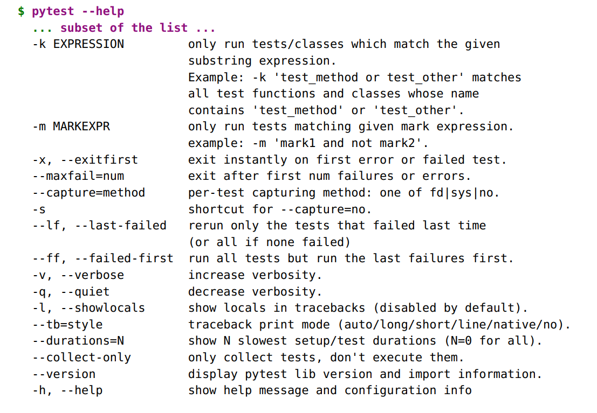

### Getting Started with pytest

#### Pre-reqs:
- Google Chrome (Recommended)

#### Lab Environment
Al labs are ready to run. All packages have been installed. There is no requirement for any setup.

All exercises are present in `~/work/testing-with-pytest/code` folder.


This is a test:

```
ch1/test_one.py

def test_passing():
    assert (1, 2, 3) == (1, 2, 3)

```

This is what it looks like when it’s run:

##### Step 1

##### $ cd /home/jovyan/work/testing-with-pytest/code/ch1 

##### $ pytest test_one.py

```
===================== test session starts ======================
collected 1 item

test_one.py.

=================== 1 passed in 0.01 seconds ===================
```


##### $ pytest -v test_one.py
```
===================== test session starts ======================
collected 1 item

test_one.py::test_passing PASSED            [100%]

=================== 1 passed in 0.01 seconds ===================
```

This is a failing test:

```
ch1/test_two.py

def test_failing():
    assert (1, 2, 3) == (3, 2, 1)
```

##### Step 2

##### $ pytest test_two.py

```
===================== test session starts ======================
collected 1 item
test_two.py F [100%]
=========================== FAILURES ===========================
_________________________ test_failing _________________________
def test_failing():
> assert (1, 2, 3) == (3, 2, 1)
E    assert (1, 2, 3) == (3, 2, 1)
E    At index 0 diff: 1 != 3
E    Use -v to get the full diff
test_two.py:2: AssertionError
=================== 1 failed in 0.10 seconds ===================
```

##### Step3 

##### $ pytest -v test_two.py

```
===================== test session starts ======================
collected 1 item

test_two.py::test_failing FAILED [100%]

===========================FAILURES===========================
_________________________test_failing_________________________

def test_failing():
> assert(1,2, 3) == (3,2, 1)
E       assert(1, 2, 3) == (3, 2, 1)
E       At index0 diff:1 != 3
E       Fulldiff:
E       - (1, 2, 3)
E? ^ ^
E       + (3, 2, 1)
E? ^ ^

test_two.py:2:AssertionError
=================== 1 failed in 0.05 seconds ===================
```

### Getting pytest

The headquarters for pytest is https://docs.pytest.org. That’s the official documentation.
```
python3 -m venv venv
source venv/bin/activate
pip install pytest
```

Windows

```
$ python -m pip install virtualenv
$ python -m virtualenv venv
$ source venv/bin/activate
$ pip install pytest
```

The sourcevenv/bin/activate line won’t work for Windows, use venv\Scripts\activate.bat instead.
Do this:

```
C:\> python3 -m venv venv
C:\> venv\Scripts\activate.bat
C:\> pip install pytest
```
### Running pytest

##### Step 4 

##### $ pytest --help

```
usage:pytest[options][file_or_dir][file_or_dir][...]
...
```


For example, let’s create a subdirectory called tasks, and start with this test file:

```
ch1/tasks/test_three.py

"""Test the Task data type."""

from collections import namedtuple

Task = namedtuple('Task', ['summary', 'owner', 'done', 'id'])
Task.__new__.__defaults__ = (None, None, False, None)


def test_defaults():
    """Using no parameters should invoke defaults."""
    t1 = Task()
    t2 = Task(None, None, False, None)
    assert t1 == t2

def test_member_access():
    """Check .field functionality of namedtuple."""
    t = Task('buy milk', 'brian')
    assert t.summary == 'buy milk'
    assert t.owner == 'brian'
    assert (t.done, t.id) == (False, None)

```

You can use __new__.__defaults__ to create Task objects without having to specify
all the fields. 
Demonstrate the _asdict() and _replace() functionality:

```
ch1/tasks/test_four.py

"""Test the Task data type."""

from collections import namedtuple

Task = namedtuple('Task', ['summary', 'owner', 'done', 'id'])
Task.__new__.__defaults__ = (None, None, False, None)

def test_asdict():
    """_asdict() should return a dictionary."""
    t_task = Task('do something', 'okken', True, 21)
    t_dict = t_task._asdict()
    expected = {'summary': 'do something',
                'owner': 'okken',
                'done': True,
                'id': 21}
    assert t_dict == expected


def test_replace():
    """replace() should change passed in fields."""
    t_before = Task('finish book', 'brian', False)
    t_after = t_before._replace(id=10, done=True)
    t_expected = Task('finish book', 'brian', True, 10)
    assert t_after == t_expected

t_expected= Task( 'finishbook' , 'brian' , True,10)
assert t_after== t_expected
```

Run pytest

##### Step 5

##### $ cd /home/jovyan/work/testing-with-pytest/code/ch1 

##### $ pytest

```
===================== test session starts ======================
collected 6 items

test_one.py. [ 16%]
test_two.pyF [ 33%]
tasks/test_four.py.. [ 66%]
tasks/test_three.py.. [100%]

===========================FAILURES===========================
_________________________test_failing_________________________

def test_failing():
> assert(1,2, 3) == (3,2, 1)
E       assert(1, 2, 3) == (3, 2, 1)
E       At index0 diff:1 != 3
E       Use -v to get the fulldiff

test_two.py:2:AssertionError
============== 1 failed, 5 passed in 0.17 seconds ==============
```

Call pytest from the directory where our tests are:

##### Step 6

##### $ pytest tasks/test_three.py tasks/test_four.py

```
===================== test session starts ======================
collected 4 items

tasks/test_three.py.. [ 50%]
tasks/test_four.py.. [100%]

=================== 4 passed in 0.02 seconds ===================
```

##### Step 7

##### $ pytest tasks

```
===================== test session starts ======================
collected 4 items

tasks/test_four.py.. [ 50%]
tasks/test_three.py.. [100%]

=================== 4 passed in 0.02 seconds ===================
```

##### Step 8

##### $ cd tasks

##### $ pytest

```
===================== test session starts ======================

collected 4 items

test_four.py.. [ 50%]
test_three.py.. [100%]

=================== 4 passed in 0.02 seconds ===================
```


The part of pytest execution where pytest goes off and finds which tests to
run is called _test discovery_. 
- Test files should be named test_<something>.py or <something>_test.py.
- Test methods and functions should be named test_<something>.
- Test classes should be named Test<Something>.

##### Step 9
   
##### $ cd /home/jovyan/work/testing-with-pytest/code/ch1/tasks

##### $ pytest test_three.py
    
```
===================== test session starts ======================
platform darwin -- Python 3.x.y, pytest-3.x.y, py-1.x.y, pluggy-0.x.y
rootdir: /home/jovyan/work/testing-with-pytest/code/ch1, inifile:
collected 2 items
test_three.py .. [100%]
=================== 2 passed in 0.01 seconds ===================
```


Here are the possible outcomes of a test function:

- PASSED (.): The test ran successfully.
- FAILED (F): The test did not run successfully (or XPASS + strict).
- SKIPPED (s): The test was skipped. You can tell pytest to skip a test by
    using either the @pytest.mark.skip() or pytest.mark.skipif() decorators, discussed
    in Skipping Tests
- xfail (x): The test was not supposed to pass, ran, and failed. You can tell
    pytest that a test is expected to fail by using the @pytest.mark.xfail() decorator,
    discussed in Marking Tests as Expecting to Fail
- XPASS (X): The test was not supposed to pass, ran, and passed.
- ERROR (E): An exception happened outside of the test function, in either
    a fixture, discussed in Lab 3, pytest Fixtures, or in a
    hook function, discussed in Lab 5, Plugins


### Running Only One Test

One of the first things you’ll want to do once you’ve started writing tests is to
run just one. Specify the file directly, and add a ::test_name, like this:

##### Step 10

##### $ cd /home/jovyan/work/testing-with-pytest/code/ch1

##### $ pytest -v tasks/test_four.py::test_asdict
    
```
===================== test session starts ======================
collected 1 item

tasks/test_four.py::test_asdict PASSED            [100%]

=================== 1 passed in 0.01 seconds ===================
```

### Using Options

##### Step 11

##### $ pytest --help




**--collect-only**

The --collect-only option shows you which tests will be run with the given options
and configuration. 

##### Step 12

##### $ cd /home/jovyan/work/testing-with-pytest/code/ch1
    
##### $ pytest --collect-only

```
=================== test session starts ===================
collected 6 items
<Module'test_one.py'>
<Function'test_passing'>
<Module'test_two.py'>
<Function'test_failing'>
<Module'tasks/test_four.py'>
<Function'test_asdict'>
<Function'test_replace'>
<Module'tasks/test_three.py'>
<Function'test_defaults'>
<Function'test_member_access'>

==============no tests ran in 0.02 seconds ===============
```

The --collect-only option is helpful to check if other options that select tests are correct
before running the tests. We’ll use it again with -k to show how that works.

**-k EXPRESSION**

##### Step 13 

##### $ cd /home/jovyan/work/testing-with-pytest/code/ch1
    
##### $ pytest -k "asdict or defaults" --collect-only

```
=================== test session starts ===================
collected 6 items/ 4 deselected
<Module'tasks/test_four.py'>
<Function'test_asdict'>
<Module'tasks/test_three.py'>
<Function'test_defaults'>

==============4 deselectedin 0.02 seconds ===============
```

##### Step 14 

##### $ pytest -k "asdict or defaults"
    

```
=================== test session starts ===================
collected 6 items/ 4 deselected

tasks/test_four.py. [ 50%]
tasks/test_three.py. [100%]

========= 2 passed,4 deselectedin 0.03 seconds ==========
```

##### Step 15 

##### $ pytest -v -k "asdict or defaults"

```
=================== test session starts ===================
collected 6 items/ 4 deselected

tasks/test_four.py::test_asdict PASSED            [ 50%]
tasks/test_three.py::test_defaults PASSED            [100%]

========= 2 passed, 4 deselectedin 0.02 seconds ==========
```

**-m MARKEXPR**

Markers are one of the best ways to mark a subset of your test functions so
that they can be run together.
```
import pytest

...
@pytest.mark.run_these_please
def test_member_access ():
...
```

Do the same for test_replace().

##### Step 16 

##### $ cd /home/jovyan/work/testing-with-pytest/code/ch1/tasks
    
##### $ pytest -m run_these_please

```
=================== test session starts ===================
collected 4 items / 2 deselected
test_four.py . [ 50%]
test_three.py . [100%]
========= 2 passed, 2 deselected in 0.02 seconds ==========
```

**-x, --exitfirst**

Let’s try it on the six tests we have so far:

##### Step 17

##### $ cd /home/jovyan/work/testing-with-pytest/code/ch1
    
##### $ pytest -x

```
=================== test session starts ===================
collected 6 items

test_one.py. [ 16%]
test_two.pyF

========================FAILURES=========================
______________________test_failing_______________________

def test_failing():
> assert(1,2, 3) == (3,2, 1)
E       assert(1, 2, 3) == (3, 2, 1)
E       At index0 diff:1 != 3
E       Use -v to get the fulldiff

test_two.py:2:AssertionError
=========== 1 failed, 1 passed in 0.13 seconds ============
```

Near the top of the output you see that all six tests (or “items”) were collected ,
and in the bottom line you see that one test failed and one passed.

##### Step 18

##### $ cd /home/jovyan/work/testing-with-pytest/code/ch1
    
##### $ pytest --tb=no 

```
=================== test session starts ===================
collected 6 items

test_one.py. [ 16%]
test_two.pyF [ 33%]
tasks/test_four.py.. [ 66%]
tasks/test_three.py.. [100%]

=========== 1 failed, 5 passed in 0.07 seconds ============
```

This demonstrates that without the -x, pytest notes failure in test_two.py and
continues on with further testing.

**--maxfail=num**

The -x option stops after one test failure. 

##### Step 19 

##### $ cd /home/jovyan/work/testing-with-pytest/code/ch1
    
##### $ pytest --maxfail=2 --tb=no

```
=================== test session starts ===================
collected 6 items
test_one.py . [ 16%]
test_two.py F [ 33%]
tasks/test_four.py .. [ 66%]
tasks/test_three.py .. [100%]
=========== 1 failed,  5 passed in 0.07 seconds ============
```

##### Step 20

##### $ pytest --maxfail=1 --tb=no 
    
```
=================== test session starts ===================
collected 6 items
test_one.py . [ 16%]
test_two.py F
=========== 1 failed,  1 passed in 0.07 seconds ============
```

**-s and --capture=method**

The -s flag allows print statements—or really any output that normally would
be printed to stdout—to actually be printed to stdout while the tests are running.

##### Step 21

##### $ cd /home/jovyan/work/testing-with-pytest/code/ch1

##### $ pytest --lf

```
=================== test session starts ===================
collected 6 items / 5 deselected
run-last-failure: rerun previous 1 failure
test_two.py F [100%]
======================== FAILURES =========================
______________________ test_failing _______________________
def test_failing():
> assert (1, 2, 3) == (3, 2, 1)
E       assert (1, 2, 3) == (3, 2, 1)
E       At index 0 diff: 1 != 3
E       Use -v to get the full diff
test_two.py:2: AssertionError
========= 1 failed,  5 deselected in 0.07 seconds ==========
```

**--ff, --failed-first**

The --ff/--failed-first option will do the same as --last-failed
    
##### Step 22 

##### $ cd /home/jovyan/work/testing-with-pytest/code/ch1

##### $ pytest --ff --tb=no 
    
##### $ pytest --ff --tb=no 

```
=================== test session starts ===================
collected 6 items
run-last-failure: rerun previous 1 failure first
test_two.py F [ 16%]
```

##### Step 23

##### $ cd /home/jovyan/work/testing-with-pytest/code/ch1

##### $ pytest --ff --tb=no 

##### $ pytest --ff --tb=no 

```
=================== test session starts ===================
collected 6 items
run-last-failure: rerun previous 1 failure first
test_two.py F [ 16%]
```

**-v, --verbose**

The -v/--verbose option reports more information than without it.
    
##### Step 24 

##### $ cd /home/jovyan/work/testing-with-pytest/code/ch1

##### $ pytest -v --ff --tb=no 

```
=================== test session starts ===================
collected 6 items
run-last-failure: rerun previous 1 failure first
test_two.py::test_failing FAILED [ 16%]
test_one.py::test_passing PASSED            [ 33%]
tasks/test_four.py::test_asdict PASSED            [ 50%]
tasks/test_four.py::test_replace PASSED            [ 66%]
tasks/test_three.py::test_defaults PASSED            [ 83%]
tasks/test_three.py::test_member_access PASSED            [100%]
=========== 1 failed,  5 passed in 0.08 seconds ============
```

**-q, --quiet**

The -q/--quiet option is the opposite of -v/--verbose

##### Step 25 

##### $ cd /home/jovyan/work/testing-with-pytest/code/ch1

##### $ pytest -q

```
.F.... [100%]
======================== FAILURES =========================
______________________ test_failing _______________________
def test_failing():
> assert (1, 2, 3) == (3, 2, 1)
E       assert (1, 2, 3) == (3, 2, 1)
E       At index 0 diff: 1 != 3
E       Full diff:
E       - (1, 2, 3)
E       ? ^ ^
E       + (3, 2, 1)
E       ? ^ ^
test_two.py:2: AssertionError
1 failed,  5 passed in 0.08 seconds
```

**-l, --showlocals**

local variables and their values are displayed

```
t_expected= Task( 'finishbook' , 'brian' , True,10)

to

t_expected= Task( 'finishbook' , 'brian' , True,11)
```

##### Step 26

##### $ cd /home/jovyan/work/testing-with-pytest/code/ch1

##### $ pytest -l tasks

```
=================== test session starts ===================
collected 4 items
tasks/test_four.py .F [ 50%]
tasks/test_three.py .. [100%]
======================== FAILURES =========================
______________________ test_replace _______________________

def test_replace():
    """replace() should change passed in fields."""
    t_before = Task('finish book', 'brian', False)
    t_after = t_before._replace(id=10, done=True)
    t_expected = Task('finish book', 'brian', True, 10)
    assert t_after == t_expected


E       AssertionError: assert Task(summary=...e=True, id=10) ==
Task(summary='...e=True, id=11)
E       At index 3 diff: 10 != 11
E       Use -v to get the full diff

t_after = Task(summary='finish book', owner='brian', done=True, id=10)
t_before = Task(summary='finish book', owner='brian', done=False, id=None)
t_expected = Task(summary='finish book', owner='brian', done=True, id=11)
tasks/test_four.py:24: AssertionError
=========== 1 failed,  3 passed in 0.07 seconds ============

```

**--tb=style**

The --tb=style option modifies the way tracebacks for failures are output. 
--tb=no removes the traceback entirely:

##### Step 27

##### $ cd /home/jovyan/work/testing-with-pytest/code/ch1

##### $ pytest --tb=no tasks

```
=================== test session starts ===================
collected 4 items

tasks/test_four.py.F [ 50%]
tasks/test_three.py.. [100%]

=========== 1 failed, 3 passed in 0.06 seconds ============
```

--tb=line in many cases is enough to tell what’s wrong. 

##### Step 28

##### $ pytest --tb=linetasks

```
=================== test session starts ===================
collected 4 items

tasks/test_four.py.F [ 50%]
tasks/test_three.py.. [100%]

========================FAILURES=========================
/home/jovyan/work/testing-with-pytest/code/ch1/tasks/test_four.py:24:
AssertionError:assertTask(summary=...e=True, id=10)==
Task(summary='...e=True,id=11)
=========== 1 failed, 3 passed in 0.07 seconds ============
```

##### Step 29

##### $ pytest --tb=shorttasks
    
```
=================== test session starts ===================
collected 4 items

tasks/test_four.py.F [ 50%]
tasks/test_three.py.. [100%]

========================FAILURES=========================
______________________test_replace_______________________
tasks/test_four.py:24:in test_replace
assertt_after== t_expected
E       AssertionError:assertTask(summary=...e=True,id=10)==
Task(summary='...e=True,id=11)
E       At index3 diff:10 != 11
E       Use -v to get the fulldiff
=========== 1 failed, 3 passed in 0.07 seconds ============
```

**--durations=N**

##### Step 30

##### $ cd /home/jovyan/work/testing-with-pytest/code/ch1

##### $ pytest --durations=3 tasks

```
=================== test session starts ===================
collected 4 items
tasks/test_four.py .. [ 50%]
tasks/test_three.py .. [100%]
================ slowest 3 test durations =================
0.10s call tasks/test_four.py::test_replace
0.00s setup tasks/test_three.py::test_defaults
0.00s teardown tasks/test_four.py::test_asdict
================ 4 passed in 0.13 seconds =================
```

**--version**

The --version option shows the version of pytest and the directory where it’s
installed:

##### Step 31

##### $ pytest --version

```
This is pytest version 3.x.y, imported from
/path/to/venv/lib/python3.x/site-packages/pytest.py
```

**-h, --help**


## Exercises

1. Create a new virtual environment using python -m virtualenv or python -m venv.
Even if you know you don’t need virtual environments for the project
you’re working on, humor me and learn enough about them to create one
for trying out things in this course. I resisted using them for a very long
time, and now I always use them. Read Appendix 1, Virtual Environments, if you’re having any difficulty.

2. Practice activating and deactivating your virtual environment a few times.

    - $ source venv/bin/activate
    - $ deactivate

On Windows:

- C:\Users\okken\sandbox>venv\scripts\activate.bat
- C:\Users\okken\sandbox>deactivate

3. Install pytest in your new virtual environment. See pip if you have any trouble. Even if you thought you already had
pytest installed, you’ll need to install it into the virtual environment you
just created.

4. Create a few test files. You can use the ones we used in this lab or
make up your own. Practice running pytest against these files.

5. Change the assert statements. Don’t just use assert something == something_else;
try things like:

- assert 1 in [2, 3, 4]
- assert a < b
- assert 'fizz' not in 'fizzbuzz'

### What’s Next

In this lab, we looked at where to get pytest and the various ways to run
it. However, we didn’t discuss what goes into test functions. In the next
lab, we’ll look at writing test functions, parametrizing them so they get
called with different data, and grouping tests into classes, modules, and
packages.


