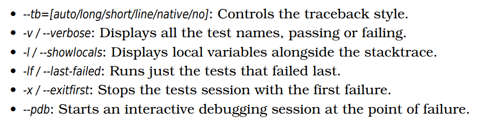
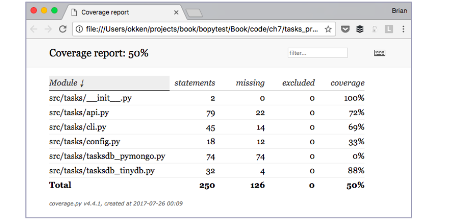
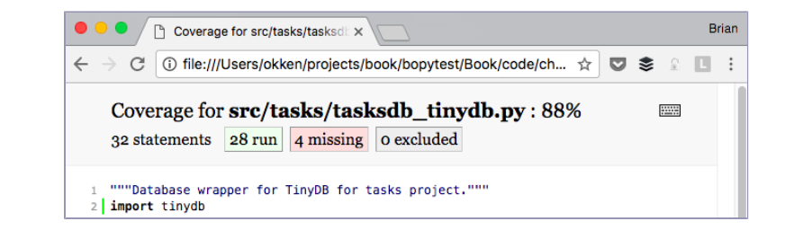
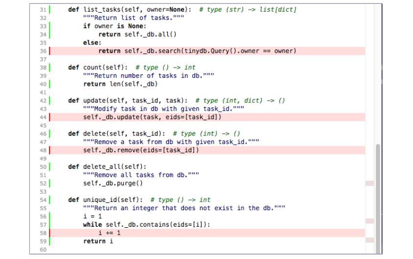

### Using pytest with Other Tools

You don’t usually use pytest on its own, but rather in a testing environment
with other tools. This lab looks at other tools that are often used in
combination with pytest for effective and efficient testing. While this is by no
means an exhaustive list, the tools discussed here give you a taste of the
power of mixing pytest with other tools.

#### Pre-reqs:
- Google Chrome (Recommended)

#### Lab Environment
Al labs are ready to run. All packages have been installed. There is no requirement for any setup.

All exercises are present in `/pytest-labs/testing-with-pytest/code` folder.


### pdb: Debugging Test Failures

The pdb module is the Python debugger in the standard library. You use --pdb
to have pytest start a debugging session at the point of failure. Let’s look at
pdb in action in the context of the Tasks project.

In Parametrizing Fixtures, we left the Tasks project with a few
failures:


##### Step 1


##### $ cd /pytest-labs/testing-with-pytest/code/ch3/c/tasks_proj

##### $ pytest --tb=no -q

```
.........................................FF.FFFFFFF[ 53%]

FFFFFFFFFFFFFFFFFFFFFFFFFFFFFF.FFF........... [100%]
42 failed, 54 passed in 5.51seconds
```

Before we look at how pdb can help us debug this test, let’s take a look at the
pytest options available to help speed up debugging test failures



**Installing MongoDB**

As mentioned in Lab 3, pytest Fixtures, running
the MongoDB tests requires installing MongoDB and pymongo.
I’ve been testing with the Community Server edition found at
https://www.mongodb.com/download-center. pymongo is installed with pip:


```
pip install pymongo
```

However, this is the last example in the course that
uses MongoDB. To try out the debugger without using MongoDB,
you could run the pytest commands from code/ch2/, as this directory
also contains a few failing tests.

We just ran the tests from code/ch3/c to see that some of them were failing. We
didn’t see the tracebacks or the test names because --tb=no turns off trace-
backs, and we didn’t have --verbose turned on. Let’s re-run the failures (at most
three of them) with verbose:


##### Step 2

##### $ pytest --tb=no --verbose --lf --maxfail=3

```
=================== test session starts ===================
plugins:cov-2.5.1
collected 96 items/ 54 deselected
run-last-failure:rerunprevious42 failures

tests/func/test_add.py::test_add_returns_valid_id[mongo] FAILED [2%]
tests/func/test_add.py::test_added_task_has_id_set[mongo] FAILED [4%]
tests/func/test_add_variety.py::test_add_1[mongo] FAILED [7%]

========= 3 failed, 54 deselected in 3.12 seconds =========
```

Now we know which tests are failing. Let’s look at just one of them by using
-x, including the traceback by not using --tb=no , and showing the local vari-
ables with -l:


##### Step 3


##### $ pytest -v --lf -l -x

```
=================== test session starts ===================
plugins:cov-2.5.1
collected 96 items/ 54 deselected
run-last-failure:rerunprevious42 failures

tests/func/test_add.py::test_add_returns_valid_id[mongo] FAILED [2%]

========================FAILURES=========================
____________test_add_returns_valid_id[mongo]_____________

tasks_db= None

def test_add_returns_valid_id(tasks_db):
"""tasks.add(<validtask>)shouldreturnan integer."""
# GIVENan initializedtasksdb
# WHENa new taskis added
# THENreturnedtask_idis of typeint
new_task= Task('dosomething')
task_id= tasks.add(new_task)
```


```
> assertisinstance(task_id,int)
E AssertionError:assertFalse
E + whereFalse= isinstance(ObjectId('5b8c12dccb02981dc226d897'),int)

new_task = Task(summary='dosomething',owner=None,done=False,id=None)
task_id = ObjectId('5b8c12dccb02981dc226d897')
tasks_db = None

tests/func/test_add.py:16:AssertionError
========= 1 failed, 54 deselected in 2.91 seconds =========
```

Quite often this is enough to understand the test failure. In this particular
case, it’s pretty clear that task_id is not an integer—it’s an instance of ObjectId.
ObjectId is a type used by MongoDB for object identifiers within the database.

We can have pytest start a debugging session and start us right at the point of failure with --pdb:


##### Step 4


##### $ pytest -v --lf -x --pdb

```
=================== test session starts ===================
plugins: cov-2.5.1
collected 96 items / 54 deselected
run-last-failure: rerun previous 42 failures
tests/func/test_add.py::test_add_returns_valid_id[mongo] FAILED [ 2%]
>>>>>>>>>>>>>>>>>>>>>>>> traceback >>>>>>>>>>>>>>>>>>>>>>>>
tasks_db = None
def test_add_returns_valid_id(tasks_db):
"""tasks.add(<valid task>) should return an integer."""
# GIVEN an initialized tasks db
# WHEN a new task is added
# THEN returned task_id is of type int
new_task = Task('do something')
task_id = tasks.add(new_task)
> assert isinstance(task_id, int)
E AssertionError: assert False
E + where False = isinstance(ObjectId('5b8c1316cb02981dc91fccd1'), int)
tests/func/test_add.py:16: AssertionError

>>>>>>>>>>>>>>>>>>>>>> entering PDB >>>>>>>>>>>>>>>>>>>>>>>
> /pytest-labs/testing-with-pytest/code/ch3/c/tasks_proj/tests/func/test_add.py(16)
> test_add_returns_valid_id()
-> assert isinstance(task_id, int)
(Pdb)
```


Now that we are at the (Pdb) prompt, we have access to all of the interactive
debugging features of pdb. When looking at failures, I regularly use these
commands:

- p/printexpr: Prints the value of exp.

- pp expr: Pretty prints the value of expr.

- l/list: Lists the point of failure and five lines of code above and below.

- l/list begin,end: Lists specific line numbers.

- a/args: Prints the arguments of the current function with their values. (This
    is helpful when in a test helper function.)

- u/up: Moves up one level in the stack trace.

- d/down: Moves down one level in the stack trace.

- q/quit: Quits the debugging session.

Other navigation commands like step and next aren’t that useful since we are
sitting right at an assert statement. You can also just type variable names and
get the values.

You can use p/printexpr similar to the -l/--showlocals option to see values within
the function:

```
(Pdb)p new_task
Task(summary='dosomething',owner=None, done=False,id=None)
(Pdb)p task_id
ObjectId('5b8c1316cb02981dc91fccd1')
(Pdb)
```

Now you can quit the debugger and continue on with testing.

```
(Pdb)q

======== 1 failed, 54 deselected in 87.51 seconds =========
```

If we hadn’t used -x, pytest would have opened pdb again at the next failed
test. More information about using the pdb module is available in the Python
documentation.

### Coverage.py: Determining How Much Code Is Tested

Code coverage is a measurement of what percentage of the code under test
is being tested by a test suite. When you run the tests for the Tasks project,

1. https://docs.python.org/3/library/pdb.html


some of the Tasks functionality is executed with every test, but not all of it.
Code coverage tools are great for telling you which parts of the system are
being completely missed by tests.

Coverage.py is the preferred Python coverage tool that measures code coverage.
You’ll use it to check the Tasks project code under test with pytest.

Before you use coverage.py, you need to install it. I’m also going to have you
install a plugin called pytest-cov that will allow you to call coverage.py from pytest
with some extra pytest options. Since coverage is one of the dependencies of
pytest-cov, it is sufficient to install pytest-cov, as it will pull in coverage.py:


##### Step 4


##### $ pip install pytest-cov

```
...
Installing collected packages: coverage, pytest-cov
Successfully installed coverage-4.5.1 pytest-cov-2.5.1
```

Let’s run the coverage report on version 2 of Tasks. If you still have the first
version of the Tasks project installed, uninstall it and install version 2:


##### Step 5 


##### $ pip uninstall tasks

```
Uninstalling tasks-0.1.0:
...
Proceed (y/n)? y
Successfully uninstalled tasks-0.1.0
```


##### Step 6


##### $ cd /pytest-labs/testing-with-pytest/code/ch7/tasks_proj_v2

##### $ pip install -e .

```
Obtaining file:///pytest-labs/testing-with-pytest/code/ch7/tasks_proj_v2
...
Installing collected packages: tasks
Running setup.py develop for tasks
Successfully installed tasks
```


##### Step 7


##### $ pip list

```
...
tasks 0.1.1 /pytest-labs/testing-with-pytest/code/tasks_proj_v2/src
...

```

Now that the next version of Tasks is installed, we can run our baseline cov-
erage report:


##### Step  8


##### $ cd /pytest-labs/testing-with-pytest/code/ch7/tasks_proj_v2

##### $ pytest --cov=src

```
=================== test session starts ===================
plugins:mock-1.10.0,cov-2.5.1
collected 62 items

tests/func/test_add.py... [ 4%]
tests/func/test_add_variety.py....................[ 37%]
........ [ 50%]
tests/func/test_add_variety2.py............ [ 69%]
tests/func/test_api_exceptions.py......... [ 83%]
tests/func/test_unique_id.py. [ 85%]
tests/unit/test_cli.py..... [ 93%]
tests/unit/test_task.py.... [100%]

----------coverage:platformdarwin,python3.7.0-final-0-----------
Name Stmts Miss Cover
--------------------------------------------------
src/tasks/__init__.py 2 0 100%
src/tasks/api.py 79 22 72%
src/tasks/cli.py 45 14 69%
src/tasks/config.py 18 12 33%
src/tasks/tasksdb_pymongo.py 74 74 0%
src/tasks/tasksdb_tinydb.py 32 4 88%
--------------------------------------------------
TOTAL 250 126 50%

================ 62 passed in 0.62 seconds ================
```

Since the current directory is tasks_proj_v2 and the source code under test is
all within src, adding the option --cov=src generates a coverage report for that
specific directory under test only.

If you run coverage.py again with --cov-report=html, an HTML report is generated:


##### Step 9


##### $ pytest --cov=src--cov-report=html

```
=================== test session starts ===================
plugins:mock-1.10.0,cov-2.5.1

collected 62 items

tests/func/test_add.py... [ 4%]
tests/func/test_add_variety.py....................[ 37%]
........ [ 50%]
tests/func/test_add_variety2.py............ [ 69%]
tests/func/test_api_exceptions.py......... [ 83%]
tests/func/test_unique_id.py. [ 85%]
tests/unit/test_cli.py..... [ 93%]
tests/unit/test_task.py.... [100%]

----------coverage:platformdarwin,python3.7.0-final-0-----------
CoverageHTMLwrittento dir htmlcov

================ 62 passed in 0.70 seconds ================
```

You can then open htmlcov/index.html in a browser, which shows the output in
the following screen:



Clicking on tasksdb_tinydb.py shows a report for the one file. The top of the report
shows the percentage of lines covered, plus how many lines were covered and
how many are missing, as shown in the following screen:



Scrolling down, you can see the missing lines, as shown in the next screen:



Even though this screen isn’t the complete page for this file, it’s enough to
tell us that:

1. We’re not testing list_tasks() with owner set.
2. We’re not testing update() or delete().
3. We may not be testing unique_id() thoroughly enough.

While code coverage tools are extremely useful, striving for 100% coverage
can be dangerous. When you see code that isn’t tested, it might mean a test
is needed. But it also might mean that there’s some functionality of the system
that isn’t needed and could be removed. Like all software development tools,
code coverage analysis does not replace thinking.


2. https://coverage.readthedocs.io
3. https://pytest-cov.readthedocs.io


### mock: Swapping Out Part of the System

The mock package is used to swap out pieces of the system to isolate bits of
our code under test from the rest of the system. Mock objects are sometimes
called test doubles, spies, fakes, or stubs. Between pytest’s own monkeypatch
fixture (covered in Using monkeypatch and mock, you should
have all the test double functionality you need.

**Mocks Are Weird**

For the Tasks project, we’ll use mock to help us test the command-line interface.
In Coverage.py: Determining How Much Code Is Tested, you saw
that our cli.py file wasn’t being tested at all. We’ll start to fix that now. But
let’s first talk about strategy.

An early decision in the Tasks project was to do most of the functionality
testing through api.py. Therefore, it’s a reasonable decision that the command-
line testing doesn’t have to be complete functionality testing. We can have a
fair amount of confidence that the system will work through the CLI if we
mock the API layer during CLI testing. It’s also a convenient decision, allowing
us to look at mocks in this section.

The implementation of the Tasks CLI uses the Click third-party command-
line interface package. There are many alternatives for implementing a CLI,
including Python’s builtin argparse module. One of the reasons I chose Click
is because it includes a test runner to help us test Click applications. However,
the code in cli.py, although hopefully typical of Click applications, is not
obvious.

4. [http://click.pocoo.org](http://click.pocoo.org)


Let’s pause and install version 2 of Tasks:


##### Step 10


##### $ cd /pytest-labs/testing-with-pytest/code/

##### $ pip install -e ch7/tasks_proj_v2

```
...
Successfully installed tasks
```

In the rest of this section, you’ll develop some tests for the “list” functionality.
Let’s see it in action to understand what we’re going to test:


##### Step 11


##### $ tasks list

```
ID owner done summary
-- ----- ---- -------
```


##### Step 12


##### $ tasks add "do something great"

##### $ tasks add "repeat" -o Brian

##### $ tasks add "again and again" --owner Okken

##### $ tasks list

```
ID owner done summary
-- ----- ---- -------
1 False do something great
2 Brian False repeat
3 Okken False again and again
```


##### Step 13


##### $ tasks list -o Brian

```
ID owner done summary
-- ----- ---- -------
2 Brian False repeat
```


##### Step 14


##### $ tasks list --owner Brian

```
ID owner done summary
-- ----- ---- -------
2 Brian False repeat
```

Looks pretty simple. The tasks list command lists all the tasks with a header.
It prints the header even if the list is empty. It prints just the things from one
owner if -o or --owner are used. How do we test it? Lots of ways are possible,
but we’re going to use mocks.

Tests that use mocks are necessarily white-box tests, and we have to look
into the code to decide what to mock and where. The main entry point is here:

```
ch7/tasks_proj_v2/src/tasks/cli.py

if __name__ == '__main__':
    tasks_cli()
```

That’s just a call to tasks_cli():

```
ch7/tasks_proj_v2/src/tasks/cli.py

@click.group(context_settings={'help_option_names': ['-h', '--help']})
@click.version_option(version='0.1.1')
def tasks_cli():
    """Run the tasks application."""
    pass
```

Obvious? No. But hold on, it gets better (or worse, depending on your perspec-
tive). Here’s one of the commands—the list command:

```
ch7/tasks_proj_v2/src/tasks/cli.py

@tasks_cli.command(name="list", help="list tasks")
@click.option('-o', '--owner', default=None,
              help='list tasks with this owner')
def list_tasks(owner):
    """
    List tasks in db.

    If owner given, only list tasks with that owner.
    """
    formatstr = "{: >4} {: >10} {: >5} {}"
    print(formatstr.format('ID', 'owner', 'done', 'summary'))
    print(formatstr.format('--', '-----', '----', '-------'))
    with _tasks_db():
        for t in tasks.list_tasks(owner):
            done = 'True' if t.done else 'False'
            owner = '' if t.owner is None else t.owner
            print(formatstr.format(
                  t.id, owner, done, t.summary))
```

Once you get used to writing Click code, it’s not that bad. I’m not going to
explain all of this here, as developing command-line code isn’t the focus of
the book; however, even though I’m pretty sure I have this code right, there’s
lots of room for human error. That’s why a good set of automated tests to
make sure this works correctly is important.

This list_tasks(owner) function depends on a couple of other functions: _tasks_db(),
which is a context manager, and tasks.list_tasks(owner), which is the API function.
We’re going to use mock to put fake functions in place for _tasks_db() and
tasks.list_tasks(). Then we can call the list_tasks method through the command-
line interface and make sure it calls the tasks.list_tasks() function correctly and
deals with the return value correctly.

To stub _tasks_db(), let’s look at the real implementation:

```
ch7/tasks_proj_v2/src/tasks/cli.py

@contextmanager
def _tasks_db():
    config = tasks.config.get_config()
    tasks.start_tasks_db(config.db_path, config.db_type)
    yield
    tasks.stop_tasks_db()
```

The _tasks_db() function is a context manager that retrieves the configuration
from tasks.config.get_config(), another external dependency, and uses the config-
uration to start a connection with the database. The yield releases control to


the with block of list_tasks(), and after everything is done, the database connection
is stopped.

For the purpose of just testing the CLI behavior up to the point of calling API
functions, we don’t need a connection to an actual database. Therefore, we
can replace the context manager with a simple stub:

```
ch7/tasks_proj_v2/tests/unit/test_cli.py

@contextmanager
def stub_tasks_db():
    yield
```

Because this is the first time we’ve looked at our test code for test_cli,py, let’s
look at this with all of the import statements:

```
ch7/tasks_proj_v2/tests/unit/test_cli.py

from click.testing import CliRunner
from contextlib import contextmanager
import pytest
from tasks.api import Task
import tasks.cli
import tasks.config


@contextmanager
def stub_tasks_db():
    yield
```

Those imports are for the tests. The only import needed for the stub is from
contextlib importcontextmanager.

We’ll use mock to replace the real context manager with our stub. Actually,
we’ll use mocker, which is a fixture provided by the pytest-mock plugin. Let’s look
at an actual test. Here’s a test that calls tasks list:

```
ch7/tasks_proj_v2/tests/unit/test_cli.py

def test_list_no_args(mocker):
    mocker.patch.object(tasks.cli, '_tasks_db', new=stub_tasks_db)
    mocker.patch.object(tasks.cli.tasks, 'list_tasks', return_value=[])
    runner = CliRunner()
    runner.invoke(tasks.cli.tasks_cli, ['list'])
    tasks.cli.tasks.list_tasks.assert_called_once_with(None)
```

The mocker fixture is provided by pytest-mock as a convenience interface to
unittest.mock. 

- The first line, mocker.patch.object(tasks.cli,'_tasks_db',new=stub_tasks_db),
replaces the _tasks_db() context manager with our stub that does nothing.
- The second line, mocker.patch.object(tasks.cli.tasks,'list_tasks',return_value=[]), replaces
any calls to tasks.list_tasks() from within tasks.cli to a default MagicMock object with
a return value of an empty list.
- The third and fourth lines of test_list_no_args() use the Click CliRunner to do the
same thing as calling tasks list on the command line.
- The final line uses the mock object to make sure the API call was called cor-
rectly. The assert_called_once_with() method is part of unittest.mock.Mock objects,
which are all listed in the Python documentation.

Let’s look at an almost identical test function that checks the output:

```
ch7/tasks_proj_v2/tests/unit/test_cli.py

@pytest.fixture()
def no_db(mocker):
    mocker.patch.object(tasks.cli, '_tasks_db', new=stub_tasks_db)


def test_list_print_empty(no_db, mocker):
    mocker.patch.object(tasks.cli.tasks, 'list_tasks', return_value=[])
    runner = CliRunner()
    result = runner.invoke(tasks.cli.tasks_cli, ['list'])
    expected_output = ("  ID      owner  done summary\n"
                       "  --      -----  ---- -------\n")
    assert result.output == expected_output
```

This time we put the mock stubbing of tasks_db into a no_db fixture so we
can reuse it more easily in future tests. The mocking of tasks.list_tasks() is
the same as before. This time, however, we are also checking the output
of the command-line action through result.output and asserting equality to
expected_output.

The rest of the tests for the tasks list functionality don’t add any new concepts,
but perhaps looking at several of these makes the code easier to understand:

```
ch7/tasks_proj_v2/tests/unit/test_cli.py

def test_list_print_many_items(no_db, mocker):
    many_tasks = (
        Task('write chapter', 'Brian', True, 1),
        Task('edit chapter', 'Katie', False, 2),
        Task('modify chapter', 'Brian', False, 3),
        Task('finalize chapter', 'Katie', False, 4),
    )
    mocker.patch.object(tasks.cli.tasks, 'list_tasks',
                        return_value=many_tasks)
    runner = CliRunner()
    result = runner.invoke(tasks.cli.tasks_cli, ['list'])
    expected_output = ("  ID      owner  done summary\n"
                       "  --      -----  ---- -------\n"
                       "   1      Brian  True write chapter\n"
                       "   2      Katie False edit chapter\n"
                       "   3      Brian False modify chapter\n"
                       "   4      Katie False finalize chapter\n")
    assert result.output == expected_output


def test_list_dash_o(no_db, mocker):
    mocker.patch.object(tasks.cli.tasks, 'list_tasks')
    runner = CliRunner()
    runner.invoke(tasks.cli.tasks_cli, ['list', '-o', 'brian'])
    tasks.cli.tasks.list_tasks.assert_called_once_with('brian')


def test_list_dash_dash_owner(no_db, mocker):
    mocker.patch.object(tasks.cli.tasks, 'list_tasks')
    runner = CliRunner()
    runner.invoke(tasks.cli.tasks_cli, ['list', '--owner', 'okken'])
    tasks.cli.tasks.list_tasks.assert_called_once_with('okken')

```

Let’s make sure they all work:


##### Step 15


##### $ cd /pytest-labs/testing-with-pytest/code/ch7/tasks_proj_v2

##### $ pytest -v tests/unit/test_cli.py

```
=================== test session starts ===================
plugins:mock-1.10.0,cov-2.5.1
collected 5 items

tests/unit/test_cli.py::test_list_no_args PASSED            [ 20%]
tests/unit/test_cli.py::test_list_print_emptyPASSED[ 40%]
tests/unit/test_cli.py::test_list_print_many_itemsPASSED[ 60%]
tests/unit/test_cli.py::test_list_dash_o PASSED            [ 80%]
tests/unit/test_cli.py::test_list_dash_dash_ownerPASSED[100%]

================ 5 passed in 0.07 seconds =================
```

Yay! They pass.


This was an extremely fast fly-through of using test doubles and mocks. If
you want to use mocks in your testing, I encourage you to read up on
unittest.mock in the standard library documentation, and about pytest-mock at
pypi.python.org.

### tox: Testing Multiple Configurations

tox is a command-line tool that allows you to run your complete suite of tests
in multiple environments.
In gross generalities, here’s a mental model for how tox works:

tox uses the setup.py file for the package under test to create an installable
source distribution of your package. It looks in tox.ini for a list of environments
and then for each environment...

1. tox creates a virtual environment in a .tox directory.
2. tox pip install s some dependencies.
3. tox pip install s your package from the sdist in step 1.
4. tox runs your tests.

After all of the environments are tested, tox reports a summary of how they
all did.


Here’s the abbreviated code layout:

6. https://docs.python.org/dev/library/unittest.mock.html
7. https://pypi.python.org/pypi/pytest-mock


```
tasks_proj_v2/
├──...
├──setup.py
├──tox.ini
├──src
│ └──tasks
│ ├──__init__.py
│ ├──api.py
│ └──...
└──tests
├──conftest.py
├──func
│ ├──__init__.py
│ ├──test_add.py
│ └──...
└──unit
├──__init__.py
├──test_task.py
└──...
```

```
Now, here’s what the tox.ini file looks like:

ch7/tasks_proj_v2/tox.ini

# tox.ini , put in same dir as setup.py

[tox]
envlist = py27,py37

[testenv]
deps=pytest
commands=pytest

[pytest]
addopts = -rsxX -l --tb=short --strict
markers = 
  smoke: Run the smoke test test functions
  get: Run the test functions that test tasks.get()
```

Under [tox], we have envlist= py27,py37. This is a shorthand to tell tox to run
our tests using python2.7, python3.7

Under [testenv], the deps=pytest line tells tox to make sure pytest is installed. If
you have multiple test dependencies, you can put them on separate lines.
You can also specify which version to use.

The commands=pytest line tells tox to run pytest in each environment.

Under [pytest], we can put whatever we normally would want to put into pytest.ini
to configure pytest, as discussed in Lab 6, Configuration In
this case, addopts is used to turn on extra summary information for skips,
xfails, and xpasses (-rsxX) and turn on showing local variables in stack traces

Before running tox, you have to make sure you install it:


##### Step 16


##### $ pip install tox


This can be done within a virtual environment.

Then to run tox, just run, well, tox:


##### Step 17


##### $ cd /pytest-labs/testing-with-pytest/code/ch7/tasks_proj_v2

##### $ tox

```
GLOBsdist-make:/pytest-labs/testing-with-pytest/code/ch7/tasks_proj_v2/setup.py
py27inst-nodeps:/pytest-labs/testing-with-pytest/code/ch7/tasks_proj_v2/.tox/dist/tasks-0.1.1.zip
py27installed:atomicwrites==1.2.1,attrs==18.2.0,Click==7.0,funcsigs==1.0.2,
mock==2.0.0,more-itertools==4.3.0,pathlib2==2.3.2,pbr==5.0.0,pluggy==0.8.0,
py==1.7.0,pytest==3.9.1,pytest-mock==1.10.0,scandir==1.9.0,six==1.11.0,
tasks==0.1.1,tinydb==3.11.1

py27runtests:PYTHONHASHSEED='2121166562'
py27runtests:commands[0]| pytest

======================== test session starts ========================
plugins:mock-1.10.0
collected 62 items

tests/func/test_add.py... [ 4%]
tests/func/test_add_variety.py............................ [ 50%]
tests/func/test_add_variety2.py............ [ 69%]
tests/func/test_api_exceptions.py......... [ 83%]
tests/func/test_unique_id.py. [ 85%]
tests/unit/test_cli.py..... [ 93%]
tests/unit/test_task.py.... [100%]

===================== 62 passed in 0.51 seconds =====================

py37inst-nodeps:/pytest-labs/testing-with-pytest/code/ch7/tasks_proj_v2/.tox/dist/tasks-0.1.1.zip
py37installed:atomicwrites==1.2.1,attrs==18.2.0,Click==7.0,
more-itertools==4.3.0,pluggy==0.8.0,py==1.7.0,pytest==3.9.1,
pytest-mock==1.10.0,six==1.11.0,tasks==0.1.1,tinydb==3.11.1
py37runtests:PYTHONHASHSEED='2121166562'
py37runtests:commands[0]| pytest

======================== test session starts ========================
plugins:mock-1.10.0
collected 62 items

tests/func/test_add.py... [ 4%]
tests/func/test_add_variety.py............................ [ 50%]
tests/func/test_add_variety2.py............ [ 69%]
tests/func/test_api_exceptions.py......... [ 83%]
tests/func/test_unique_id.py. [ 85%]
tests/unit/test_cli.py..... [ 93%]
tests/unit/test_task.py.... [100%]
```


```
===================== 62 passed in 0.46 seconds =====================
______________________________summary______________________________
py27:commandssucceeded
py37:commandssucceeded
congratulations:)
```

At the end, we have a nice summary of all the test environments and their
outcomes:

```
_________________________summary_________________________
py27:commandssucceeded
py37:commandssucceeded
congratulations:)
```

Doesn’t that give you a nice, warm, happy feeling? We got a “congratulations”
_and_ a smiley face.

tox is much more powerful than what I’m showing here and deserves your
attention if you are using pytest to test packages intended to be run in multiple
environments. For more detailed information, check out the tox documentation.


### unittest: Running Legacy Tests with pytest

unittest is the test framework built into the Python standard library. Its
purpose is to test Python itself, but it is often used for project testing, too.
pytest works as a unittest runner, and can run both pytest and unittest tests
in the same session. First, let’s look at a test written for unittest:

```
ch7/unittest/test_delete_unittest.py

import unittest
import shutil
import tempfile
import tasks
from tasks import Task


def setUpModule():
    """Make temp dir, initialize DB."""
    global temp_dir
    temp_dir = tempfile.mkdtemp()
    tasks.start_tasks_db(str(temp_dir), 'tiny')


def tearDownModule():
    """Clean up DB, remove temp dir."""
    tasks.stop_tasks_db()
    shutil.rmtree(temp_dir)


class TestNonEmpty(unittest.TestCase):

    def setUp(self):
        tasks.delete_all()  # start empty
        # add a few items, saving ids
        self.ids = []
        self.ids.append(tasks.add(Task('One', 'Brian', True)))
```


```
self.ids.append(tasks.add(Task( 'Two' , 'StillBrian' , False)))
self.ids.append(tasks.add(Task( 'Three' , 'NotBrian' , False)))
def test_delete_decreases_count (self):
# GIVEN3 items
self.assertEqual(tasks.count(),3)
# WHENwe deleteone
tasks.delete(self.ids[0])
# THENcountdecreasesby 1
self.assertEqual(tasks.count(),2)
```

The actual test is at the bottom, test_delete_decreases_count(). The rest of the code
is there for setup and teardown. This test runs fine in unittest:


##### Step 18


##### $ cd /pytest-labs/testing-with-pytest/code/ch7/unittest

##### $ python -m unittest -v test_delete_unittest.py

```
test_delete_decreases_count(test_delete_unittest.TestNonEmpty)... ok

----------------------------------------------------------------------
Ran 1 testin 0.029s

OK
```

It also runs fine in pytest:


##### Step 19


##### $ pytest -v test_delete_unittest.py

```
=================== test session starts ===================
plugins:mock-1.10.0,cov-2.5.1
collected 1 item

test_delete_unittest.py::TestNonEmpty::test_delete_decreases_countPASSED[100%]

================ 1 passed in 0.02 seconds =================
```

This is great if you just want to use pytest as a test runner for unittest.
However, our premise is that the Tasks project is migrating to pytest. Let’s
say we want to migrate tests one at a time and run both unittest and pytest
versions at the same time until we are confident in the pytest versions. Let’s
look at a rewrite for this test and then try running them both:

```
ch7/unittest/test_delete_pytest.py

import tasks


def test_delete_decreases_count(db_with_3_tasks):
    ids = [t.id for t in tasks.list_tasks()]
    # GIVEN 3 items
    assert tasks.count() == 3
    # WHEN we delete one
    tasks.delete(ids[0])
    # THEN count decreases by 1
    assert tasks.count() == 2
```

The fixtures we’ve been using for the Tasks project, including db_with_3_tasks
introduced in Using Multiple Fixtures, help set up the database
before the test. It’s a much smaller file, even though the test function itself
is almost identical.

Both tests pass individually:


##### Step  20


##### $ pytest -q test_delete_pytest.py


```
. [100%]
1 passed in 0.02seconds
```


##### Step 21


##### $ pytest -q test_delete_unittest.py

```
. [100%]
1 passed in 0.02seconds
```

You can even run them together if—and only if—you make sure the unittest
version runs first:


##### Step 22


##### $ pytest -v test_delete_unittest.pytest_delete_pytest .py

```
=================== test session starts ===================
plugins:mock-1.10.0,cov-2.5.1
collected 2 items

test_delete_unittest.py::TestNonEmpty::test_delete_decreases_countPASSED[ 50%]
test_delete_pytest .py::test_delete_decreases_countPASSED[100%]

================ 2 passed in 0.03 seconds =================
```

If you run the pytest version first, something goes haywire:


##### Step 23


##### $ pytest -v test_delete_pytest.pytest_delete_unittest.py

```
=================== test session starts ===================
collected 2 items

test_delete_pytest.py::test_delete_decreases_countPASSED[ 50%]
test_delete_unittest.py::TestNonEmpty::test_delete_decreases_countPASSED[100%]
test_delete_unittest.py::TestNonEmpty::test_delete_decreases_countERROR[100%]

=========================ERRORS==========================
ERRORat teardownof TestNonEmpty.test_delete_decreases_count
...

conftest.py:12:in tasks_db_session
tasks.stop_tasks_db()
_ _ _ _ _ _ _ _ _ _ _ _ _ _ _ _ _ _ _ _ _ _ _ _ _ _ _ _ _ _

def stop_tasks_db(): _# type:() -> None_
"""DisconnectAPI functionsfromdb."""
global_tasksdb
> _tasksdb.stop_tasks_db()
E AttributeError:'NoneType'objecthas no attribute'stop_tasks_db'

../tasks_proj_v2/src/tasks/api.py:128:AttributeError
============ 2 passed,1 error in 0.14 seconds ============
```

You can see that something goes wrong at the end, after both tests have run
and passed.

Let’s use --setup-show to investigate further:


##### Step 24


##### $ pytest -q --tb=no --setup-show test_delete_pytest.pytest_delete_unittest.py

```
SETUP S tmpdir_factory
SETUP S tasks_db_session(fixturesused:tmpdir_factory)
SETUP F tasks_db(fixturesused:tasks_db_session)
SETUP F tasks_just_a_few
SETUP F db_with_3_tasks (fixturesused:tasks_db,tasks_just_a_few)
test_delete_pytest.py::test_delete_decreases_count
(fixturesused:db_with_3_tasks,tasks_db,tasks_db_session,
tasks_just_a_few,tmpdir_factory).
TEARDOWNF db_with_3_tasks
TEARDOWNF tasks_just_a_few
TEARDOWNF tasks_db
test_delete_unittest.py::TestNonEmpty::test_delete_decreases_count.
TEARDOWNS tasks_db_session
TEARDOWNS tmpdir_factoryE
2 passed,1 error in 0.15 seconds
```

The session scope teardown fixtures are run after all the tests, including the
unittest tests. This stumped me for a bit until I realized that the tearDownModule()
in the unittest module was shutting down the connection to the database.
The tasks_db_session() teardown from pytest was then trying to do the same thing
afterward.

Fix the problem by using the pytest session scope fixture with the unittest
tests. This is possible by adding @pytest.mark.usefixtures() decorators at the class
or method level:

```
ch7/unittest/test_delete_unittest_fix.py

import pytest
import unittest
import tasks
from tasks import Task


@pytest.mark.usefixtures('tasks_db_session')
class TestNonEmpty(unittest.TestCase):

    def setUp(self):
        tasks.delete_all()  # start empty
        # add a few items, saving ids
        self.ids = []
        self.ids.append(tasks.add(Task('One', 'Brian', True)))
        self.ids.append(tasks.add(Task('Two', 'Still Brian', False)))
        self.ids.append(tasks.add(Task('Three', 'Not Brian', False)))
```


```
def test_delete_decreases_count (self):
_# GIVEN3 items_
self.assertEqual(tasks.count(),3)
_# WHENwe deleteone_
tasks.delete(self.ids[0])
_# THENcountdecreasesby 1_
self.assertEqual(tasks.count(),2)
```

Now both unittest and pytest can cooperate and not run into each other:


##### Step 25


##### $ pytest -v test_delete_pytest.pytest_delete_unittest_fix.py

```
=================== test session starts ===================
plugins:mock-1.10.0,cov-2.5.1
collected 2 items

test_delete_pytest.py::test_delete_decreases_countPASSED[ 50%]
test_delete_unittest_fix.py::TestNonEmpty::test_delete_decreases_countPASSED[100%]

================ 2 passed in 0.03 seconds =================
```

Note that this is only necessary for session scope resources shared by unittest
and pytest. As discussed earlier in Marking Test Functions, you
can also use pytest markers on unittest tests, such as @pytest.mark.skip() and
@pytest.mark.xfail(), and user markers like @pytest.mark.foo().

Going back to the unittest example, we still used setUp() to save the ids of the
tasks. Aside from highlighting that getting a list of ids from tasks is obviously
an overlooked API method, it also points to a slight issue with using
pytst.mark.usefixtures with unittest: we can’t pass data from a fixture to a unittest
function directly.

However, you can pass it through the cls object that is part of the request object.
In the next example, setUp() code has been moved into a function scope fixture
that passes the ids through request.cls.ids:

```
ch7/unittest/test_delete_unittest_fix2.py

import pytest
import unittest
import tasks
from tasks import Task


@pytest.fixture()
def tasks_db_non_empty(tasks_db_session, request):
    tasks.delete_all()  # start empty
    # add a few items, saving ids
    ids = []
    ids.append(tasks.add(Task('One', 'Brian', True)))
    ids.append(tasks.add(Task('Two', 'Still Brian', False)))
    ids.append(tasks.add(Task('Three', 'Not Brian', False)))
    request.cls.ids = ids

@pytest.mark.usefixtures( _'tasks_db_non_empty'_ )
class TestNonEmpty(unittest.TestCase):

def test_delete_decreases_count (self):
# GIVEN3 items
self.assertEqual(tasks.count(),3)
# WHENwe deleteone
tasks.delete(self.ids[0])
# THENcountdecreasesby 1
self.assertEqual(tasks.count(),2)
```

The test accesses the ids list through self.ids, just like before.

- The ability to use marks has a limitation: you cannot use parametrized fixtures
with unittest-based tests.
- Another limitation with running unittest with pytest is that unittest subtests
will stop at the first failure, while unittest will run each subtest, regardless
of failures.

### Exercises

1. The test code in ch2 has a few intentionally failing tests. Use --pdb while
running these tests. Try it without the -x option and the debugger will
open multiple times, once for each failure.
2. Try fixing the code and rerunning tests with --lf --pdb to just run the failed
tests and use the debugger. Trying out debugging tools in a casual envi-
ronment where you can play around and not be worried about deadlines
and fixes is important.
3. We noticed lots of missing tests during our coverage exploration. One
topic missing is to test tasks.update(). Write some tests of that in the func
directory.
4. Run coverage.py. What other tests are missing? If you covered api.py, do you
think it would be fully tested?
5. Add some tests to test_cli.py to check the command-line interface for tasks
update using mock.
6. Run your new tests (along with all the old ones) against at least two Python
versions with tox.
7. Try using Jenkins to graph all the different tasks_proj versions and test
permutations in the labs.


